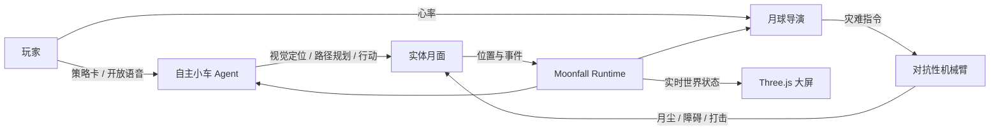
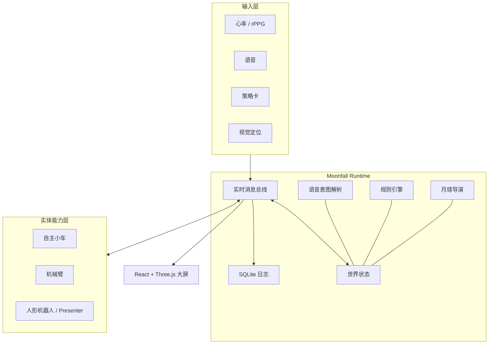

# Moonfall Ark · 探月方舟

> 一款会读取玩家心率、理解开放语音，并让自主小车与对抗性机械臂在真实空间中共同演出的具身 AI 游戏；也是一台配置驱动的具身 AI 游戏创作引擎。

[](https://github.com/Moonfall-Lab/moonfall-ark)
[](backend/app/main.py)
[](frontend/README.md)
[](LICENSE)

**赛道：** 软件赛道 · AI & Agent

**产品定位：** 具身 AI 游戏创作平台，Moonfall 为首款样板游戏

**GitHub：** <https://github.com/Moonfall-Lab/moonfall-ark>

---

## 一句话概述

四名幸存者迫降月球，必须收集燃料、修复方舟并升空返航；玩家不直接遥控机器人，而是通过策略卡与开放语音影响自主小车。四名玩家的心率会持续改变“月球狂暴度”，并驱动机械臂向实体地图投放月尘、陨石与干扰。

## 我们解决什么问题

今天的机器人体验通常停留在两端：一端是遥控或编程教学，参与门槛高；另一端是固定流程的设备表演，内容难以复用。创作者若想做一个新的实体互动游戏，需要同时理解机器人控制、视觉定位、传感器、实时通信与规则开发。

Moonfall Ark 把这些能力收敛成一套游戏运行时和配置 IR：

- **玩家负责意图，Agent 负责行动。** 策略与自然语言被转成闭合的动作空间，小车自主完成移动、采集、返航与避障。
- **人的状态成为游戏输入。** 心率不是展示数据，而是直接影响难度和机械臂事件。
- **物理设备成为可组合能力。** 小车、机械臂、心率、语音、定位与大屏通过统一消息协议接入，不互相写死。
- **创作者定义玩法，而不是重写驱动。** 地图、阵营、单位、输入、事件和规则由配置描述；同一套硬件可以承载不同游戏。

## 样板游戏：Moonfall

人类方舟计划的登月舱迫降月球背面，能源核心破碎。四名幸存者指挥探测车在实体月面收集氦-3 与遗迹碎片，修复飞船并尝试升空。

月球拥有意志，名为“上帝之手”。它能感知玩家的紧张程度：心率越高，月球越狂暴；月怒跨过阈值后，机械臂会悬停警告、投放月尘或打击目标，迫使小车重新规划路线。玩家需要在资源竞争、风险控制和情绪管理之间做出选择。

**胜利：** 收集足够燃料、保持飞船存活并完成点火。

**失败：** 飞船生命值归零，或未能在回合上限前升空。

## 核心闭环



这条链路中的输入、状态、指令和事件都使用统一消息封套，经 WebSocket 实时分发并写入 SQLite 日志，可用于现场调试与复盘。

## 已实现能力

| 模块 | 当前实现 |
| --- | --- |
| 实时游戏运行时 | FastAPI + WebSocket；统一世界状态、每秒广播、HTTP 控制接口、事件与 AI 日志 |
| 配置驱动 | YAML / JSON 游戏配置、JSON Schema、语义与 DSL 设计；提供 Moonfall、FFA MVP、Scavenger 三份示例 |
| 开放语音 | 从当前配置派生合法机器人、区域和动作；支持 DeepSeek / NVIDIA OpenAI-compatible；无 Key 时规则兜底 |
| 心率闭环 | `sensor.hr` 实时输入、玩家压力与 0-100 月怒分档；支持局域网 rPPG bridge |
| 月球导演 | 按月怒阈值生成 `drop_dust` / `strike` 等 `cmd.arm` 指令，机械臂默认安全模式 |
| 视觉导航小车 | 顶视相机 + ArUco 场地标定、厘米坐标、A* 绕障、闭环差速控制、多车 Fleet、UDP 看门狗与停车保护 |
| 动态障碍 | 固定地标与临时障碍分层；上层可在回合间替换月尘/陨石区域，小车按最新地图重新规划 |
| 3D 实时大屏 | React + Three.js；3D 月面、双车/多车状态、燃料、船体、BPM、月怒、事件、发射与灾难效果 |
| 可观测性 | 功能日志、AI 解析日志、世界状态接口、FastAPI Swagger 文档 |
| 无硬件演示 | 心率、语音、小车、机械臂 fake clients；前端断线自动进入 mock 模式 |

## 系统架构



Runtime 是唯一的实时状态中心。前端、小车、机械臂、心率与语音客户端只连接 Runtime，不互相直连。统一边界让物理驱动、屏幕模拟和无头测试可以履行同一能力契约。

## 为什么它是一台引擎

Moonfall 是平台运行的首款样板游戏。平台把设备抽象为六类能力：

| 能力 | 游戏中的作用 |
| --- | --- |
| `Mover` | 自主移动、路径跟随、停车 |
| `Manipulator` | 抓、放、推、悬停警告与安全打击 |
| `BioSignalSource` | 心率、HRV 与相对基线压力 |
| `VoiceIntent` | 将开放语言约束到游戏动作空间 |
| `PoseSource` | 提供实体单位的统一世界坐标 |
| `Presenter` | 解说、巡游与角色化反馈，可由人形机器人或屏幕角色实现 |

游戏配置只声明需要什么能力，不绑定设备品牌。`binding.physical.json` 与 `binding.software.json` 展示了同一份游戏如何分别运行在实体设备和屏幕模拟驱动上；三份示例游戏均使用同一种强类型 IR。

相关设计：[`docs/engine_platform_design.md`](docs/engine_platform_design.md) · [`docs/schema/CONFIG_GUIDE.md`](docs/schema/CONFIG_GUIDE.md) · [`docs/schema/game_config.schema.json`](docs/schema/game_config.schema.json)

## 快速运行

### 环境要求

- Python 3.11+
- Node.js 18+
- 可选：DeepSeek API Key 或 NVIDIA OpenAI-compatible 服务
- 实体版可选：顶视摄像头、Deskbot 小车、机械臂、rPPG 服务

### 1. 启动 Runtime

macOS / Linux：

```bash
git clone https://github.com/Moonfall-Lab/moonfall-ark.git
cd moonfall-ark
cp .env.example .env

python3 -m venv .venv
source .venv/bin/activate
pip install -r backend/requirements.txt

cd backend
uvicorn app.main:app --host 0.0.0.0 --port 8000 --reload
```

Windows：

```bat
git clone https://github.com/Moonfall-Lab/moonfall-ark.git
cd moonfall-ark
copy .env.example .env

cd backend
python -m venv .venv
.venv\Scripts\activate
pip install -r requirements.txt
uvicorn app.main:app --host 0.0.0.0 --port 8000 --reload
```

验证：

- 健康检查：<http://127.0.0.1:8000/api/health>
- 当前世界：<http://127.0.0.1:8000/api/state>
- API 文档：<http://127.0.0.1:8000/docs>
- WebSocket：`ws://127.0.0.1:8000/ws`

也可以运行：

```bash
docker compose up --build
```

### 2. 启动 3D 大屏

```bash
cd frontend
npm install
npm run dev
```

打开 <http://127.0.0.1:5173>。大屏默认连接本机 `8000` 端口；局域网演示使用：

```text
http://前端地址:5173/?host=后端电脑IPv4:8000
```

使用 `?mock=1` 可以在没有 Runtime 和硬件时预览完整界面。左上角 `LIVE` 表示真实后端，`MOCK` 表示模拟数据。

## 3 分钟 Demo 路径

启动 Runtime 与大屏后，可使用 fake clients 验证完整消息链：

```bash
# 终端 1：心率输入
cd backend
python clients/hr_client_example.py

# 终端 2：开放语音
python clients/voice_client_example.py

# 终端 3：小车命令订阅
python clients/robot_client_example.py

# 终端 4：机械臂命令订阅
python clients/arm_client_example.py
```

在语音终端输入：

```text
让一号车绕开月尘，去中央区域采集燃料
```

可以观察到：

1. Runtime 将自然语言解析为受约束的 `VoiceIntent`。
2. WebSocket 广播 `cmd.robot`，大屏同步更新单位状态与事件流。
3. 心率输入推高月怒；达到阈值后，月球导演广播 `cmd.arm`。
4. 所有输入、AI 解析和功能事件写入 SQLite，可通过日志 API 查询。

## 真实小车导航

`backend/clients/rover_agent/` 是可独立运行的视觉导航 Agent：顶视相机识别桌面角标与车顶 ArUco，换算为厘米坐标；A* 在膨胀障碍地图上规划路径；闭环控制器持续用最新位姿修正轮速。

```bash
# 场地初始化：绑定车辆、标定桌面、圈选固定地标
PYTHONPATH=backend/clients python -m rover_agent.setup_field --camera 0

# 可视化定位与路径
PYTHONPATH=backend/clients python -m rover_agent.viz --camera 0

# 运行多车 Agent，并接入 Runtime
PYTHONPATH=backend/clients python -m rover_agent.agent \
  --camera 0 --viz \
  --config docs/schema/examples/moonfall_mvp.game.json \
  --bridge ws://127.0.0.1:8000/ws
```

详细部署、标定和故障排查见 [`backend/clients/rover_agent/README.md`](backend/clients/rover_agent/README.md) 与 [`docs/rover_navigation.md`](docs/rover_navigation.md)。

## 接入真实心率

项目提供 `backend/rppg_bridge.py`，可将多人 rPPG 服务的结果每秒转换为统一的 `sensor.hr` 消息：

```bash
cd backend
RPPG_URL=http://RPPG_SERVER:5050 \
MOONFALL_WS=ws://127.0.0.1:8000/ws \
python rppg_bridge.py
```

完整步骤见 [`docs/rppg_integration.md`](docs/rppg_integration.md)。可穿戴设备只要发送相同消息，也可以直接替换 rPPG 数据源。

## WebSocket 契约

所有实时消息使用统一格式：

```json
{
  "topic": "sensor.hr",
  "source": "hr_p1",
  "timestamp": 1720000000.0,
  "payload": {
    "player_id": "p1",
    "heart_rate": 105
  }
}
```

| 方向 | Topic | 用途 |
| --- | --- | --- |
| 客户端 → Runtime | `sensor.hr` | 心率输入 |
| 客户端 → Runtime | `input.voice` | 开放语音文本 |
| 客户端 → Runtime | `input.card` | 策略卡输入 |
| 客户端 → Runtime | `input.declare_launch` | 宣布点火 |
| 设备 → Runtime | `perception.pose` | 小车实时位姿 |
| Runtime → 全部 | `state.world` | 完整世界状态，每秒广播 |
| Runtime → 全部 | `state.event` | 游戏事件 |
| Runtime → 小车 | `cmd.robot` | 移动、采集、返航、停止等命令 |
| Runtime → 机械臂 | `cmd.arm` | 投放、悬停、打击与急停等命令 |

完整协议见 [`docs/websocket_topics.md`](docs/websocket_topics.md) 与 [`docs/rover_backend_api.md`](docs/rover_backend_api.md)。

## 项目结构

```text
moonfall-ark/
├── backend/
│   ├── app/                    # FastAPI Runtime、世界状态、规则、导演与日志
│   ├── clients/                # 心率、语音、小车、机械臂示例客户端
│   │   └── rover_agent/        # 视觉定位、规划、控制与多车编队
│   ├── configs/moonfall.yaml   # 当前 MVP 运行配置
│   └── rppg_bridge.py          # 多人 rPPG → sensor.hr
├── frontend/                   # React + Three.js 实时大屏
├── docs/
│   ├── schema/                 # 游戏配置 Schema、DSL 与多游戏示例
│   ├── engine_platform_design.md
│   ├── rover_navigation.md
│   └── rppg_integration.md
├── tests/                      # Runtime 契约与 rover 纯软件测试
├── docker-compose.yml
└── LICENSE
```

## 技术栈

- **Runtime：** Python, FastAPI, Pydantic, WebSocket, SQLite
- **AI：** DeepSeek / NVIDIA OpenAI-compatible API，规则解析兜底
- **Web：** React, Vite, Three.js, Framer Motion, Tailwind CSS
- **视觉与导航：** OpenCV, ArUco, NumPy, A*，闭环差速控制
- **设备通信：** WebSocket, HTTP, UDP
- **配置：** YAML, JSON Schema, 声明式规则 DSL

## 商业化

Moonfall 对标屏幕游戏领域的 Unity 与 Roblox：我们不只制作一款游戏，而是提供具身 AI 游戏的创作与运行基础设施。

| 场景 | 用户价值 | 潜在模式 |
| --- | --- | --- |
| STEM 教育 | 把 AI、机器人、策略与团队协作变成可参与课程 | 学校/机构授权、课程与硬件套件 |
| 线下娱乐与桌游吧 | 用同一套设备持续更新玩法，提升复玩率 | 场地订阅、内容分成 |
| 品牌活动 | 快速定制可传播的实体互动体验 | 项目制交付、模板授权 |
| 创客与开发者 | 复用行为、规则、设备驱动和游戏模板 | 创作者市场、交易抽成 |
| 康复与心理训练 | 将生理反馈、运动与任务激励结合 | 垂直机构合作、专业内容包 |

长期壁垒来自可复用的设备驱动、行为库、游戏模板，以及创作者与场地方共同形成的内容网络效应。

## 文档索引

- [具身 AI 游戏引擎平台设计](docs/engine_platform_design.md)
- [游戏配置指南](docs/schema/CONFIG_GUIDE.md)
- [规则 DSL 执行规范](docs/schema/DSL_EXECUTION_SPEC.md)
- [后端 API 契约](docs/api_contract.md)
- [WebSocket Topics](docs/websocket_topics.md)
- [视觉导航小车](docs/rover_navigation.md)
- [小车与 Runtime 接口](docs/rover_backend_api.md)
- [rPPG 心率接入](docs/rppg_integration.md)
- [Docker 部署](docs/docker.md)
- [队友快速接入](docs/teammate_quickstart.md)

## License

本项目使用 [Apache License 2.0](LICENSE)。
