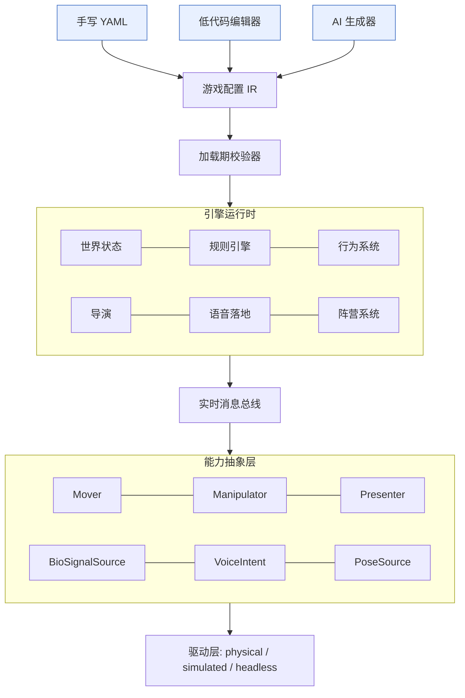
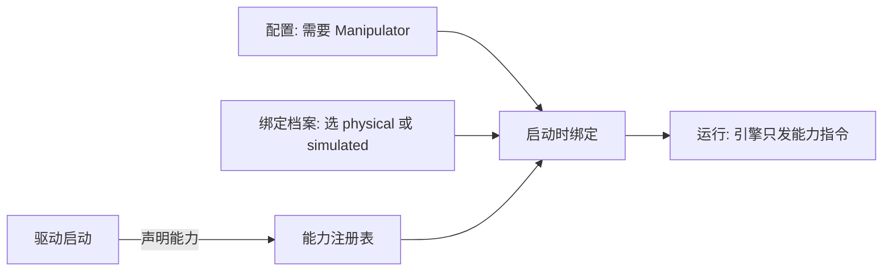
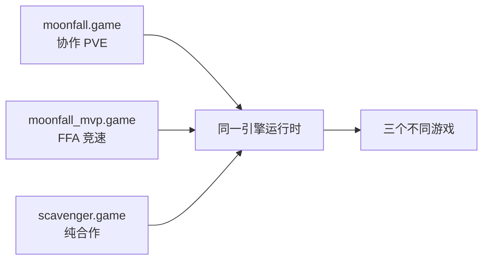

# 具身 AI 游戏引擎 · 平台设计

Moonfall 是一款样板游戏。它的底层是一台配置驱动的具身 AI 游戏引擎，对应屏幕游戏领域的 Unity 与 Roblox。创作者不写机器人代码，用一份配置就能定义地图、单位行为、机械臂动作、输入信号与规则，搭出自己的具身 AI 游戏。

本文定义三层：能力抽象层、行为库、配置 IR。字段级细节见 `schema/CONFIG_GUIDE.md`，规则语义见 `schema/DSL_EXECUTION_SPEC.md`。

## 设计原则

| 原则 | 在 Moonfall 里具体是什么 |
| --- | --- |
| 引擎是解释器，不是游戏 | 引擎代码里没有 fuel、月球、boss 这些词，它们只出现在配置里。换一个游戏无需改动引擎，只换配置。反例：把 `if fuel >= 100: win` 写进引擎，会使引擎只能服务这一个游戏。 |
| 面向能力，不面向设备 | 配置写「需要一个 Manipulator」，不写「需要 PiPER 机械臂」。换机械臂品牌只需更换驱动，不更改配置和游戏逻辑。 |
| 声明式优先 | 胜负条件写成配置 `when: "fuel>=5" then: 升空`，不写代码。策划修改规则无需工程介入。 |
| 安全在引擎层 | 配置只能调低机械臂力控上限，不能调高。AI 生成的游戏同样无法访问原始电机指令。 |
| 一份 Schema，三个前端 | 手写 YAML、可视化编辑器、AI 生成，三者产出同一份 `.game.json`，由同一个引擎运行。 |
| 一切可回放 | 每条消息写入日志，可重放整局，用于调试与答辩复盘。 |

## 分层架构

配置是系统的中间表示。三个前端产出它，运行时解释它，能力层执行它。



运行时不感知具体游戏，只把配置翻译成对能力的调用，能力再由驱动层落地到真实设备或屏幕模拟。

## 能力抽象层

### 能力契约

一个能力是一份带类型的契约，包含四部分。

| 部分 | 内容 |
| --- | --- |
| commands | 可接收的指令，参数在统一世界坐标系表达 |
| reports | 持续发布到世界状态的遥测 |
| safety | 引擎强制、配置不可放宽的安全约束 |
| bind | 绑定选择器，决定哪个驱动来实现 |

设备驱动通过声明自己实现哪些能力接入。同一设备可声明多种能力。

### 六类内置能力

| 能力 | 层级 | 语义 | 主要动作 |
| --- | --- | --- | --- |
| Mover | core | 自主移动体 | move_to, follow_path, set_led, stop |
| Manipulator | core | 对抗性执行器 | pick, place, drop, push, strike, hover_warning, home, emergency_stop |
| BioSignalSource | core | 心率与 HRV，每玩家一个 | 上报 hr, rr, stress，相对基线归一 |
| VoiceIntent | core | 语音落地到闭合动作空间 | 上报 intent，兼作祈愿 |
| PoseSource | core | 全场定位 | 上报各实体世界坐标 |
| Presenter | optional | 叙事与解说在场感 | goto, say, gesture, face |

Presenter 为可选能力。赛场由人形机器人履行，产品可由大屏虚拟形象或音箱履行同一契约，配置不变。

Manipulator 的安全约束不可放宽：工作半径、最大力、人体隔离、急停。打击为悬停下压，力控留余量。

### 驱动分层

一个能力有多种实现层，履行同一契约，落地方式不同。

| 层级 | Manipulator 举例 | 用途 |
| --- | --- | --- |
| physical | 真实机械臂抓放事件模块 | 赛场硬件版 |
| simulated | 屏幕虚拟手，投月尘即生成月尘精灵 | 纯软件版，网页或 App |
| headless | 无渲染，直接改世界状态 | 自动化测试与 AI 自对弈 |

行为、规则、DSL 只面向能力契约。physical 换成 simulated，引擎、配置、行为库不变。这是纯软件发行路径的技术基础。

### 绑定档案

选哪一层是运行时决定，不写进游戏配置。游戏配置保持硬件无关，tier 选择放在独立的绑定档案里。



同一份游戏配置，换一份绑定档案，就在硬件版和纯软件版之间切换。示例见 `schema/examples/binding.physical.json` 与 `binding.software.json`。

## 行为库

行为库承载单位的自主决策，也是创作者社区随时间积累价值的层。

### 行为解剖

行为是面向能力的带参效用策略。它活在库里，配置只引用并加权。

```yaml
behavior:
  id: collect_fuel
  requires: [Mover]
  params: { base_gain: 1.0, risk_penalty: 0.8 }
  score(ctx) -> float
  emit(ctx) -> Mover.move_to(nearest_resource)
```

`requires` 声明所需能力。一条行为只要目标单位具备对应能力就能复用，跨游戏、跨硬件。

### 效用仲裁

每个单位每 1 至 2 秒对所有可用行为打分，选最高分执行。

```
效用 = 卡牌权重 × 基础收益 × 环境系数 − 风险惩罚
```

卡牌临时抬高某类行为的权重。同一张卡在不同战况下产生不同行为，因为环境系数与风险由实时世界状态决定。

### 初始行为库

| id | 需要能力 | 语义 |
| --- | --- | --- |
| collect_fuel | Mover | 前往资源区采集 |
| return_and_settle | Mover | 携燃料返回结算 |
| return_and_repair | Mover | 血量低返回维修 |
| explore_relic | Mover | 前往遗迹区取卡 |
| attack_enemy_ship | Mover | 靠近并攻击敌方飞船 |
| ignition_confirm | Mover | 返回飞船完成点火确认 |
| patrol_narrate | Presenter | 巡游并解说 |
| bestow | Presenter | 走向单位做赐福姿态 |

库只增不改。配置从库里挑行为、加权、组合，定义单位的性格。

## 配置 IR

一份配置定义一个游戏。顶层块如下，字段细节见 `schema/CONFIG_GUIDE.md`。

| 块 | 职责 |
| --- | --- |
| meta | 身份：id、模式、人数、时长 |
| flow | 节奏：实时或回合制、回合阶段 |
| vars | 可变状态变量，含作用域 global / faction / unit |
| map | 网格与区域 |
| factions | 阵营 |
| relationships | 阵营关系矩阵，可对局内改写 |
| director | 上帝之手立场、倾向来源、事件表 |
| actuators / sensors | 抽象设备，按能力引用 |
| units | 自主单位与行为权重 |
| inputs | 卡牌、语音、心率映射 |
| rules | 声明式 when→then |
| tuning | 可现场调的数值 |

规则用条件到动作表达。运行时解释，换游戏换胜负只改这里。语义规范见 `schema/DSL_EXECUTION_SPEC.md`。

## 一份 Schema 表达多个游戏

同一批硬件、同一运行时，加载不同配置跑出不同游戏。这是平台断言的证据。



三份配置都通过同一个校验器，运行时直接执行。协作与对抗、阵营关系、上帝立场都是配置项。

## 面向 AI 生成

对标 Board Studio 与 Loopit，自然语言到游戏是已验证的方向。AI 生成的前提是配置本身是干净、闭合、强类型的 IR。本 schema 已按四条为 AI 铺好：

1. 闭合调色板。能力名、行为 id、区域、动作词表都是枚举，AI 从真实积木组合。
2. 校验加自愈。AI 产出必过校验器，不过就把报错喂回让它自改。
3. 分层生成。先地图与单位，再规则，再调参。
4. 目录 grounding。把能力目录、行为库、卡牌库作为上下文喂给 AI。

物理红线：AI 只在游戏设计层作业，设备控制与安全留在引擎。AI 能组合行为与规则，无法访问原始电机指令，也无法放宽安全约束。
