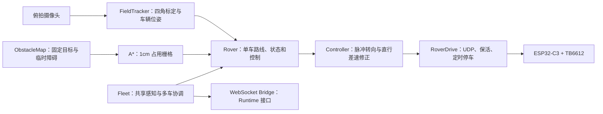

# Rover 视觉导航与网络调试交接

本文档用于把当前小车视觉导航、路径规划、运动控制、网络现象和现场数据
完整交接给后续调试 Agent。请先读“仓库与现场状态”，避免在旧分支或空地图
上重复排查。

## 1. 当前目标

后续工作集中在两条主线：

1. 路径与精度：让小车能稳定沿规划路线从 A 点到 B 点，减少大角度过转、
   左右反复修正、拐点冲过和终点误差。
2. 网络与识别：区分 Wi-Fi/UDP 延迟、IP 或路由问题、视觉标记闪烁和控制
   算法问题，不要把所有“车没动”都归结为同一种故障。

当前系统已经可运行，但尚未达到“所有路线稳定复现”的现场验收状态。

## 2. 仓库、分支与现场状态

### 2.1 最新控制代码

- GitHub 仓库：`Moonfall-Lab/moonfall`
- 分支：`agent/rover-speed-position-api`
- 当前最新提交：`948be42 tune: increase rover obstacle clearance`
- 本机工作目录：
  `/private/tmp/claude-501/-Users-luke-product-drink/7f71bd6b-0fff-4306-9396-3014a28ee045/scratchpad/moonfall`
- Python 环境位于仓库上一级：`../venv/bin/python`

如果不在同一台机器，直接克隆仓库并切换上述分支。本机临时目录不是稳定路径。

重要提交顺序：

| 提交 | 内容 |
| --- | --- |
| `f5ed76e` | 车顶标记 `0..3` 固定映射为 `r0..r3` |
| `920e98b` | 修正 r0/r1 IP 对应关系 |
| `95ff2e1` | 调整障碍规划外扩 |
| `1fa23cb` | 位姿短暂丢失等待、占用格目标转固定目标任务 |
| `9d3a096` | 增加直行标定脚本 |
| `bfae1d1` | 增加左右转标定脚本 |
| `8a28472` | 标定脉冲转向、100ms 控制计算、旧路线取消 |
| `ad7e22c` | 加入车体尺寸建模 |
| `5572fe8` | 窄通道外扩、障碍 `properties`、初始化 JSON 输出 |
| `948be42` | 额外避障安全距离从 0.5cm 增到 1cm |

### 2.2 系统集成文档仓库

- GitHub 仓库：`Moonfall-Lab/moonfall-ark`
- 分支：`agent/sync-rover-agent`
- 本机工作目录：`/private/tmp/moonfall-ark-sync`
- 相关文档：
  - [后端调用接口](rover_backend_api.md)
  - [固定目标数据](rover_fixed_landmarks.md)
  - [完整导航技术说明](rover_navigation.md)

注意：截至本交接，`moonfall-ark` 同步分支代码里的
`planner.safety_clearance_cm` 仍可能是 `0.5`；最新现场值 `1.0` 在
`Moonfall-Lab/moonfall@948be42`。继续调试硬件时，以后者为准，或先同步。

### 2.3 不要覆盖的本机现场数据

最新代码工作目录目前有：

- `backend/clients/rover_agent/params.yaml`：包含现场重新圈选的 5 个目标，
  因为这是场地数据，刻意没有提交到通用代码分支。
- `rover_agent_debug.log`：运行调试日志。
- `field_test_report.txt`：现场测试报告。
- `.superpowers/`：无关的本地目录，不要提交。

不要使用 `git reset --hard`、`git checkout -- params.yaml` 或整目录清理。

## 3. 当前硬件与坐标口径

| 项目 | 当前值 |
| --- | --- |
| 场地 | 80cm × 60cm，横向为 80cm |
| 规划栅格 | 1cm × 1cm |
| 小车底盘 | 两轮差速，无编码器、无里程计 |
| 小车尺寸 | 长 6cm，宽 5.5cm |
| 定位 | 俯拍摄像头 + AprilTag + 单应变换 |
| 四角标记 | AprilTag `4,5,6,7`，自动按画面几何分配四角 |
| 车顶标记 | `0→r0`、`1→r1`、`2→r2`、`3→r3` |
| r0 | `10.202.241.122`，车顶标记 0 |
| r1 | `10.202.241.221`，车顶标记 1；曾由 `.220` 漂移至此地址 |
| UDP | 8888，文本 `"L,R"`，范围 `-100..100` |
| HTTP | 80，`GET /status` |
| 固件看门狗 | 1000ms；用户明确要求暂时不改 |
| 主机 UDP 保活 | 250ms |
| 主机旧指令有效期 | 1000ms，过期后改发 `0,0` |

OLED 显示 `WiFi OK` 只代表小车关联到热点，不代表 Mac 到小车的 IP 路由、
ARP 或 UDP 链路一定可用。IP 以 OLED 和热点租约为准，曾发生 DHCP 漂移。

## 4. 当前软件架构



核心文件：

| 文件 | 职责 | 调试重点 |
| --- | --- | --- |
| `field_tracker.py` | 摄像头、标定、位姿存储 | 检测帧间隔、丢码和时间戳 |
| `vision.py` | 位姿平滑与过期判断 | `ema_alpha`、`stale_sec` |
| `planner.py` | 占用栅格、A*、路径简化、固定目标接近点 | 通道宽度、拐点、边界安全 |
| `obstacle_map.py` | 固定/临时障碍、地图版本、业务属性 | 回合间更新和几何口径 |
| `controller.py` | 航向误差、速度映射、脉冲时长 | 过转、S 形修正、到点误差 |
| `rover.py` | 单车状态机 | 脉冲→停车→两帧观察、丢码恢复 |
| `drive.py` | UDP 发送、250ms 保活、本机定时脉冲 | 停车包丢失、网络抖动 |
| `fleet.py` | 多车生命周期和控制循环 | 只开一辆车时的健康告警 |
| `setup_field.py` | 绑车、方向校准、圈固定目标 | `o` 清空、鼠标圈、`w` 保存 |
| `calibrate_straight.py` | 测 speed 5/10 的线速度和偏航 | 每辆车分别测量 |
| `calibrate_turn.py` | 测左右转角速度 | 必须显式使用 40% 功率 |
| `agent.py` | CLI、实景叠加和 Bridge 启动 | 现场主入口 |
| `bridge.py` | `cmd.robot`、地图接口、位姿和事件 | 与 Runtime 联调 |

### 4.1 固件代码

- 仓库：`Moonfall-Lab/TableBot`
- 主文件：`jiqiren.ino`
- 本机曾克隆在：
  `/private/tmp/claude-501/-Users-luke-product-drink/7f71bd6b-0fff-4306-9396-3014a28ee045/scratchpad/tablebot-src/`
- 协议：UDP 8888，文本 `"L,R"`；HTTP 80，`GET /status`。
- 用户确认当前车辆已重新烧录，并包含 `WiFi.setSleep(false)`。

看门狗版本存在需要保留的历史差异：主机代码和用户当前口径都按 1000ms；
但此前检查 TableBot 仓库 HEAD 时曾看到 `WATCHDOG_MS 300`。我们没有修改或
提交固件。后续如果出现约 300ms 周期刹车，应先核对实际烧录源码、二进制来源
和 TableBot 当前分支，不要直接假定 GitHub HEAD 等于车内版本，也不要在未获
用户授权时修改看门狗。

## 5. 当前参数与已测数据

### 5.1 直行标定（r0）

每次脉冲 0.8s，取三次中位数：

| 速度等级 | 位移 | 估算速度 | 运动偏向 | 车头变化 | 每 20cm 横偏 |
| --- | ---: | ---: | ---: | ---: | ---: |
| 5 | 4.38cm | 5.48cm/s | +3.5° | +1.7° | +1.23cm |
| 10 | 7.13cm | 8.91cm/s | +2.5° | -0.1° | +0.88cm |

这些值写在 `params.yaml > motion_models.default.straight_speed_cm_s`。
目前只实测了 r0，却作为所有车辆默认值使用；后续必须为 r1/r2/r3 分别测量，
差异明显时写入 `motion_models.r1` 等单车覆盖段。

### 5.2 转向标定（r0）

30% 功率接近静摩擦临界点，数据不稳定：

| 功率 | 方向 | 中位转角 | 角速度 | 中心位移 |
| --- | --- | ---: | ---: | ---: |
| 30 | 左 | +13.8° | +46.0°/s | 0.20cm |
| 30 | 右 | -26.4° | -87.9°/s | 0.39cm |

40% 功率更稳定，当前控制使用这组数据：

| 功率 | 方向 | 中位转角 | 角速度 | 中心位移 |
| --- | --- | ---: | ---: | ---: |
| 40 | 左 | +65.0° | +130.1°/s | 0.84cm |
| 40 | 右 | -50.0° | -99.9°/s | 0.68cm |

左右角速度相差约 23%，可能来自电机、减速箱、轮胎摩擦、装配和供电的综合
差异。不要因为两只电机型号相同就强行把左右参数设成一样。

### 5.3 当前控制参数

```yaml
vision:
  rate_hz: 15
  ema_alpha: 0.5
  stale_sec: 0.5
  command_pose_wait_sec: 2

control:
  correction_period_ms: 100
  min_cruise_pct: 25
  max_cruise_pct: 60
  k_heading: 40
  wheel_step_pct: 5
  turn_enter_rad: 0.52
  turn_exit_rad: 0.17
  turn_pulse_fraction: 0.7
  turn_pulse_min_sec: 0.08
  turn_pulse_max_sec: 0.35
  turn_settle_sec: 0.2
  turn_confirm_frames: 2
  waypoint_tol_cm: 3
  arrive_tol_cm: 2

planner:
  vehicle_length_cm: 6
  vehicle_width_cm: 5.5
  safety_clearance_cm: 1.0
```

障碍横向规划外扩为：

```text
半车宽 2.75cm + 额外安全距离 1cm = 3.75cm
```

车长只用于计算固定目标贴近时的保守车体半径；固定目标最终允许车体边缘到
目标表面保持 1–2cm。

## 6. 已实现的运动控制逻辑

### 6.1 普通路线

1. A* 在 1cm 栅格上规划，禁止斜向切角。
2. 路径按连续方向简化，只保留拐点和终点。
3. 航向误差大于约 30° 时进入原地脉冲转向。
4. 航向误差小于约 10° 后直行，并用左右轮差速按比例修正。
5. 中间路径点 3cm 内视为到达；最终坐标 2cm 内停车并锁定 `arrived`。

### 6.2 脉冲转向

当前不是连续原地旋转，而是：

1. 根据左右实测角速度计算预计脉冲时长。
2. 每次只消除预计角度误差的 70%。
3. 单次脉冲限制在 0.08–0.35s。
4. 本机定时器结束时立即发送 `0,0`。
5. 停车等待 0.2s，再等待两张新视觉帧。
6. 重新测量角度误差，必要时再补一次脉冲。

### 6.3 固定目标

坐标落入某个固定目标的规划占用格，或直接使用 `landmark_id` 时：

1. 在目标外沿采样 24 个预接近方向。
2. 选择可达且路线最短的预接近点。
3. 到预接近点停车。
4. 以最低速度向目标贴近。
5. 连续两张不同时间的视觉帧都确认车体表面间隙在 1–2cm，才报告到达。

### 6.4 位姿闪烁容错

- 发令瞬间没有位姿：最多等待 2s，恢复后再规划。
- 移动中位姿超过 0.5s 未更新：立即停车、保留路线、状态变为 `lost`。
- 位姿恢复：继续原路线。
- 新命令失败：旧路线会先被取消，避免车辆继续执行旧目标。

## 7. 当前仍未解决的核心问题

### 7.1 偶发转弯过大

现场仍报告“转弯太大”。优先检查以下原因，按顺序实验，不要同时改多个参数：

1. **UDP 停车包丢失**：`RoverDrive.start_pulse()` 的定时结束目前只立即发送
   一次 `0,0`。如果这一包丢失，小车可能继续旋转到下一次 250ms 保活包。
   以当前 40% 功率计算，这会额外转约 25–33°，与现场现象高度吻合。
2. **标定模型只来自 r0**：r1 或其他车辆直接复用 r0 左右角速度，可能系统性
   过转或欠转。
3. **单次脉冲上限仍偏大**：0.35s 对应左转约 45.5°、右转约 35°。
4. **最小脉冲接近退出阈值**：0.08s 左转约 10.4°，而退出阈值约 10°，
   小误差时可能跨过目标方向。
5. **视觉平滑产生滞后**：`ema_alpha=0.5` 会平滑噪声，也会让运动中的角度
   读数落后真实车头。

推荐的第一个代码实验：仅对转向脉冲结束增加 2–3 个短间隔停车包，例如
间隔 15–25ms；普通巡航仍保持 250ms 限频，避免重新拥塞弱链路。比较修改前后
30°/60°/90° 左右转的过转分布。该实验不需要修改固件看门狗。

如果仍过转，再依次尝试：

- `turn_pulse_max_sec: 0.35 → 0.20`；
- `turn_pulse_fraction: 0.7 → 0.5`；
- 每辆车单独标定 `left_turn_deg_s/right_turn_deg_s`；
- 静止和运动时分别测角度误差，评估 `ema_alpha: 0.5 → 0.7`。

### 7.2 拐点冲过与路线跟踪

当前控制器追逐“下一个离散路径点”，到达拐点附近才切换目标方向。网络和
视觉存在延迟时，车辆可能先冲过拐点，再开始转向。

尚未实现但值得优先评估：

- 接近大角度拐点时提前降到 speed 3–5；
- 用实测线速度和总延迟计算提前量；
- 使用路径前方的前视点，而不是死盯当前拐点，让车沿平滑弧线跟踪；
- 距离场地边缘 3–5cm 的区域作为规划禁入边界，防止车体出界；
- 记录每次控制使用的位姿时间戳、位姿年龄、目标点、误差和轮速。

不要直接上复杂的完整预测控制。先证明“停车包、单车标定、拐点提前降速”
三件事不能解决问题，再考虑更复杂算法。

### 7.3 终点精度

当前普通坐标任务允许 2cm 误差，固定目标按车体表面间隙 1–2cm 连续两帧
确认。短距离任务建议 speed 3–5。若仍在终点来回修正，应先记录：

- 第一次进入终点 5cm 范围时的速度和航向；
- 停车指令发出时的位姿年龄；
- 停车后惯性位移；
- 是否发生停车 UDP 包丢失。

## 8. 网络诊断上下文

### 8.1 历史测试结果

旧热点环境中曾测得：

| 实验 | 结果 |
| --- | --- |
| ping 网关 ×15 | 平均约 10ms，最大 48ms |
| ping 小车空闲 ×15 | 平均约 287ms，67–910ms，0% 丢包 |
| 同时 12.5Hz 发 `0,0` | 平均约 178ms |
| 小车拿离金属桌面 | 平均约 187ms，无明显改善；搬动瞬间曾短暂全丢 |
| 另一块小车板 | 同样约 250–335ms 形态 |

这说明 Mac 到热点本身正常，高延迟集中在小车 Wi-Fi 端。两块板表现相似，
不支持单块芯片个体损坏的假设。

历史候选原因：

1. Wi-Fi 省电；用户确认当前代码已重烧并包含关闭省电的处理，因此不再作为
   第一假设。
2. ESP32-C3 板载天线被全金属车壳遮挡；仍未完成开壳目检，是高优先级硬件
   假设。
3. DHCP 漂移或切热点后仍使用旧 IP；现场已多次发生。

### 8.2 常见日志解释

- `No route to host` / `Host is down`：主机到该 IP 的路由或邻居解析失败，
  不是视觉算法问题。
- 某辆车未开机但仍在 `params.yaml > robots` 中：健康线程会持续打印该车不可达，
  不代表已开机的另一辆车也失败。
- `UDP 恢复（此前连续失败 N 次）`：只能说明本机 `sendto` 不再立即报错；UDP
  没有应用层确认，不能证明车已执行。
- `WiFi OK`：只证明关联热点，不证明 Mac 与小车处在可互达网络。

### 8.3 每次现场调试的网络基线

先确认 OLED IP 与 `params.yaml` 一致，再执行：

```bash
# r0 连通和抖动
ping -c 30 10.202.241.122

# HTTP 状态；强制绕过系统代理
curl --noproxy '*' --connect-timeout 2 \
  http://10.202.241.122/status

# r1（只有开机时才测）
ping -c 30 10.202.241.221
curl --noproxy '*' --connect-timeout 2 \
  http://10.202.241.221/status

# 查默认路由和邻居表
route -n get default
arp -an
```

记录每辆车 ping 的最小值、中位数、95% 分位、最大值和丢包率。平均值不足以
描述控制风险；真正影响转向的是长尾延迟和连续丢包。

M0 真车通信测试会让车前进和旋转，必须先腾空场地：

```bash
PYTHONPATH=backend/clients ../venv/bin/python \
  -m rover_agent.smoke_drive 10.202.241.122
```

## 9. 视觉识别诊断

1. 四个角标记必须先完成标定；相机被碰后按 `c` 重标定。
2. 车顶贴纸上边缘必须朝车头；位置正确但箭头方向错误会让控制完全反向。
3. 场上不能出现第二张相同车 ID 的标记。
4. 记录静止 30s 的检测间隔、坐标标准差和最长丢码时间。
5. 再让车缓慢旋转，比较原始角度与 EMA 后角度的滞后。
6. 发令瞬间的闪烁已有 2s 等待容错；不要再用“单帧没看到就永久失败”的逻辑。

需要区分：

- `CALIBRATING`：四角标定未完成；
- `r0: NEVER SEEN`：从未识别车顶码；
- `lost`：曾识别，但位姿已过期；
- `unreachable`：位姿存在，但规划器找不到路线；
- 网络不可达：路径可能已规划，但 UDP 无法送达。

## 10. 固定目标与障碍数据

现场重新标注的几何数据：

| ID | X | Y | 半径 | 业务类型 |
| --- | ---: | ---: | ---: | --- |
| `obstacle-1` | 19.22 | 52.58 | 5.82 | `energy_station` |
| `obstacle-2` | 61.51 | 51.09 | 5.44 | `ruins` |
| `obstacle-3` | 37.37 | 29.88 | 5.77 | `high_energy_station` |
| `obstacle-4` | 12.71 | 10.16 | 5.94 | `ruins` |
| `obstacle-5` | 61.83 | 13.90 | 5.41 | `energy_station` |

完整 JSON 见 [固定目标数据](rover_fixed_landmarks.md)。

注意两个尚未统一的事实：

1. 最新现场 `params.yaml` 已包含几何坐标，但这些坐标没有提交到通用代码分支。
2. 业务类型目前记录在文档中；现场 `params.yaml` 的各条 landmark 尚未写入
   `properties.type`。如果 Runtime 要通过 `get_landmarks` 直接取得类型，下一步
   应把文档中的 `properties` 同步到实际配置或由上层静态配置合并。

固定目标和临时障碍都支持可 JSON 编码的 `properties`；规划器只读取几何字段。

## 11. 运行与测试命令

### 11.1 初始化场地

```bash
cd /private/tmp/claude-501/-Users-luke-product-drink/7f71bd6b-0fff-4306-9396-3014a28ee045/scratchpad/moonfall

PYTHONPATH=backend/clients ../venv/bin/python \
  -m rover_agent.setup_field --camera 0
```

摄像头窗口内按键：`o` 清空旧目标、鼠标从圆心拖到边缘、`w` 保存并输出 JSON、
`q` 退出。按键必须在 OpenCV 摄像头窗口获得焦点时输入，不是在终端里输入。

### 11.2 主控制程序

```bash
PYTHONPATH=backend/clients ../venv/bin/python \
  -m rover_agent.agent --camera 0 --viz
```

CLI：

```text
r0 30 20 5          # r0 去 (30cm,20cm)，速度 5
r0 @obstacle-1 3    # r0 靠近固定目标 obstacle-1
p r0                # 查询位姿和状态
s                   # 全场急停
q                   # 全部停车并退出
```

真车测试先用 speed 3–5，手放在急停键附近，桌面边缘安排人员防止掉落。

### 11.3 重新标定 r0/r1

直行：

```bash
PYTHONPATH=backend/clients ../venv/bin/python \
  -m rover_agent.calibrate_straight --camera 0 --car r0 \
  --speeds 5 10 --trials 3 --pulse-sec 0.8
```

转向必须显式使用 40% 功率；脚本默认 25% 对当前车可能不足：

```bash
PYTHONPATH=backend/clients ../venv/bin/python \
  -m rover_agent.calibrate_turn --camera 0 --car r0 \
  --power 40 --trials 3 --pulse-sec 0.5
```

把 `--car r0` 改为 `r1` 即可测第二辆车；只开要测试的车，避免无关网络告警。

### 11.4 软件测试

当前 `Moonfall-Lab/moonfall@948be42` 基线：202 项通过。

```bash
PYTHONPATH=backend/clients ../venv/bin/python \
  -m unittest discover -s tests -p 'test_rover*.py'
```

UDP 驱动测试需要允许绑定本机回环 socket。2026-07-11 在当前工作目录实测：

```text
Ran 202 tests in 2.639s
OK
```

## 12. 推荐的下一轮调试顺序

一次只改变一个因素，并把每次测试的参数、日志和视频对应起来。

1. **建立复现路线**：在无遮挡区域测试左/右 30°、60°、90°，每种至少 5 次。
2. **统计而不是凭观感**：记录目标角、最终角、过转、补转次数、脉冲时长、
   位姿年龄和 UDP 错误数。
3. **验证停车包假设**：先加脉冲结束停车包短突发，只改这一项重新测试。
4. **逐车标定**：r0/r1 分别测左右 40% 角速度和 speed 5/10 线速度。
5. **缩短单次盲转**：若仍过转，再把脉冲上限降到 0.20s。
6. **做路线拐点测试**：直线→90°拐弯→直线，测试提前降速或前视点。
7. **做障碍路线测试**：验证 3.75cm 橙色外扩既不擦碰，也不错误封死可通通道。
8. **最后处理硬件链路**：固定 DHCP 租约、检查金属车壳是否遮住 ESP32 天线。

建议验收指标：

| 项目 | 初步目标 |
| --- | --- |
| 30°/60°/90° 转向 | 最终误差中位数 ≤10°，95% ≤15° |
| 单次转向 | 不超过一次反向补转 |
| 20–40cm 点到点 | 终点误差中位数 ≤3cm，95% ≤5cm |
| 障碍路线 | 不碰障碍、不出场地、无持续左右摆动 |
| 视觉 | 记录最长丢码时间；正常闪烁不导致路线永久失败 |
| 网络 | 记录 ping 95% 分位和最大值；不只看平均值 |

## 13. 给后续 Agent 的边界条件

- 固件看门狗保持 1000ms，除非用户重新授权修改。
- 地图只在回合间更新；用户保证小车运动与障碍放入不会同时发生。
- 单位统一为厘米；不要重新引入米或“10cm 一格”的旧口径。
- `r0..r3` 是稳定 car ID，与车顶标记 `0..3` 一一对应。
- 不能因为一帧识别失败就丢弃命令；现有 2s 等待和路线恢复逻辑必须保留。
- 不要提交或覆盖本机现场 `params.yaml` 中的障碍坐标，除非用户明确要求把
  现场地图写死到仓库。
- 网络问题和控制问题要分开证明：先看位姿、规划、UDP 发送、HTTP 状态各层
  的证据，再修改算法。
