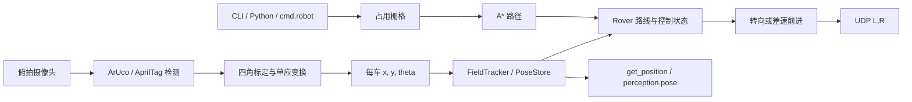
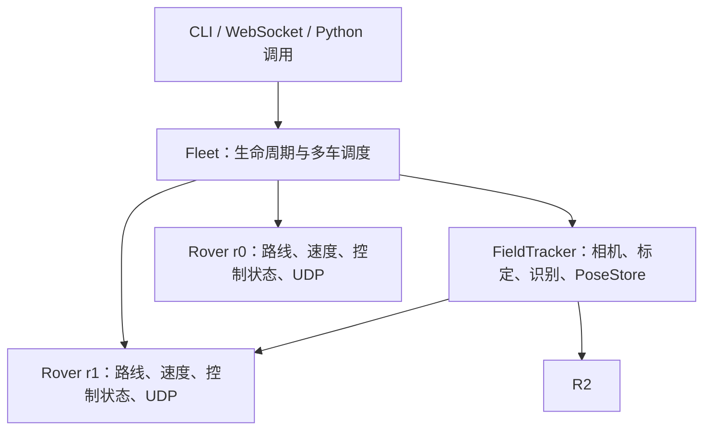
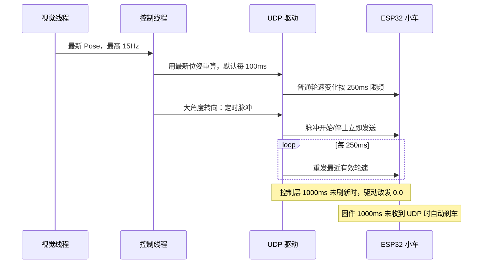

# 小车视觉定位、路径规划与运动控制

本文是 `rover_agent` 的技术入口，面向需要调用、调试或继续修改小车能力的工程师和 agent。它说明系统如何从俯拍图像得到全场坐标，如何规划路线，如何把路线转换成两轮速度，以及上层可以调用哪些接口。

## 1. 系统边界

小车没有里程计，闭环定位完全依赖俯拍摄像头。上层只需要提供：

- 车辆 ID；
- 目标厘米坐标、固定目标 ID 或目标区域；
- 速度等级 `0..10`；
- 可选的回避区域。

下层负责标定、定位、障碍栅格、A*、差速控制、UDP 保活、位姿丢失刹车和终点停车。



### 1.1 对象职责



- `FieldTracker` 只回答“场上每辆车在哪里”，不接收目标，也不计算轮速；
- 每个 `Rover` 只管理一辆物理小车，独立持有路线、速度、到达状态、实际轨迹和 UDP 驱动；
- `Fleet` 创建并启动这些对象，按固定周期调用每辆车的 `tick()`，提供批量急停、健康检查和位置查询；
- `agent.py`、`bridge.py` 和现场测试工具都是入口层，不再保存另一份车辆状态。

主要源码：

| 文件 | 职责 |
| --- | --- |
| `calibration.py` | 四角标记检测、自动角分配、像素到世界坐标变换 |
| `vision.py` | 车顶标记识别、位置和方向计算、位姿平滑与过期 |
| `field_tracker.py` | 摄像头生命周期、标定、识别与全车位姿统一入口 |
| `geometry.py` | 厘米坐标、角度和距离换算 |
| `obstacle_map.py` | 回合间障碍增删改、地图版本与占用栅格 |
| `overlay.py` | 世界坐标反投影到实景画面 |
| `planner.py` | 障碍膨胀、占用栅格和 A* |
| `controller.py` | 速度等级、转向滞回、差速修正和到达判断 |
| `drive.py` | UDP 指令、保活、指令过期停车 |
| `rover.py` | 单车路线、速度、控制状态、轨迹与 UDP 驱动 |
| `fleet.py` | 感知与多车的生命周期、控制周期和 Python 对外接口 |
| `agent.py` | CLI、可视化和进程启动入口 |
| `bridge.py` | Runtime WebSocket 消息总线适配 |
| `params.yaml` | 现场配置与全部调参入口 |

## 2. 两个坐标系

| 坐标系 | 原点与方向 | 单位 | 使用位置 |
| --- | --- | --- | --- |
| 图像坐标 | 画面左上为原点，x 向右，y 向下 | 像素 | OpenCV 检测结果 |
| 世界坐标 | 桌面左下为 `(0,0)`，x 向右，y 向上 | 厘米 | 定位、规划、CLI、接口 |

棋盘固定为横向 80cm、纵向 60cm；规划网格每格 1cm，因此坐标值和
规划格编号数值一致：

```text
x_cell = x_cm
y_cell = y_cm
```

坐标允许小数，例如 `(11.3, 34.2)` 表示距原点 `11.3cm, 34.2cm`。

方向 `theta` 在世界坐标中使用弧度：x 正方向为 `0`，逆时针为正，归一化到 `(-π, π]`。

## 3. 四角标定

### 3.1 为什么需要四个角

摄像头通常不是绝对垂直，桌面在图像中会成为梯形。系统使用一个三乘三的透视变换矩阵，也叫单应矩阵，把图像平面映射到桌面平面。

这个变换有八个有效自由度，每组二维对应点提供两个约束，因此至少需要四组不共线的对应点。三个点只能唯一确定仿射变换，无法完整消除俯拍透视，所以本实现要求四角标记同时可见才能首次标定。

### 3.2 标定过程

1. 从 `params.yaml.corners.marker_ids` 读取四个角标记 ID；
2. 检测每个标记的四个像素角点并取中心；
3. `auto_assign=true` 时，按画面几何自动分配为左下、右下、右上、左上；
4. 将它们分别对应到 `(0,0)`、`(width,0)`、`(width,height)`、`(0,height)`；
5. 求像素到 `80×60cm` 世界坐标的透视变换矩阵；
6. 相机没有移动时只需成功标定一次。相机或桌面被碰动后必须重新标定。

启动日志会打印实际角分配，例如：

```text
[calib] 自动角分配: id5→左下(原点)，id4→右下，id7→右上，id6→左上
```

## 4. 小车位姿识别

每辆车在 `params.yaml.robots` 中配置车顶标记 ID、IP 和方向补偿：

```yaml
robots:
  r0: { ip: "10.202.241.122", marker_id: 0, theta_offset_deg: 0 }
  r1: { ip: "10.202.241.221", marker_id: 1, theta_offset_deg: 0 }
```

四辆车采用固定映射：车顶标记 `0/1/2/3` 分别对应 `car_id`
`r0/r1/r2/r3`。IP 变化只更新对应配置，不改变 `car_id`。

一帧图像的处理过程：

1. 检测车顶标记的四个像素角点；
2. 四个角点分别通过单应变换进入世界坐标；
3. 四点平均值得到车中心 `(x,y)`；
4. 标记上边缘中点指向标记中心外侧的向量作为车头；
5. 加上 `theta_offset_deg`，得到最终 `theta`。

车顶贴纸的上边缘应朝车头。贴歪可以通过 `theta_offset_deg` 固定补偿；如果箭头与真实车头相反或相差 90°，路径位置可能仍正确，但控制方向会完全错误。

### 位姿平滑与短暂丢码

系统用指数滑动平均平滑连续位姿，英文简称为 EMA：

```text
filtered = alpha * new + (1 - alpha) * previous
```

角度沿最短圆弧混合，避免 `-π/π` 边界跳变。超过 `vision.stale_sec` 没有新检测时：

- `PoseStore.get()` 返回 `None`；
- 正在移动的车立即刹车，但路线保留；
- 标记恢复后继续原路线；
- `Fleet.get_position()` 仍可返回最后坐标，同时标记 `fresh=false` 和数据年龄。

这一区分可以避免把“短暂遮挡”误判为“从未见过车辆”。

## 5. 障碍建模与 A* 路径规划

### 5.1 占用栅格

场地按 `table.cell_cm=1` 切成 `80×60` 栅格。地图分成两层：

1. `params.yaml.landmarks`：开场由 `setup_field` 手动画入的固定目标，长期保存；
2. `transient_obstacles`：上层在回合间写入的临时绕行障碍，只存在内存。

两层障碍连同游戏配置中的阻挡区域一起生成占用栅格。固定目标可以成为
目的地，临时障碍只参与绕行，永远不会被自动识别成目标。

`setup_field` 中按 `w` 保存后，终端会输出完整固定目标 JSON。每条记录包含
`id / shape / x_cm / y_cm / radius_cm / properties`，其中 `properties` 是留给
上层业务的可扩展对象，例如：

```json
{
  "id": "obstacle-1",
  "shape": "circle",
  "x_cm": 26.34,
  "y_cm": 16.05,
  "radius_cm": 4.61,
  "properties": {"type": "resource", "score": 3}
}
```

系统保存、查询和更新地图时会保留 `properties`，但路径规划只读取几何字段。

圆柱的实际阻挡半径为：

```text
横向车体半径 = vehicle_width_cm / 2
规划阻挡半径 = radius_cm + 横向车体半径 + safety_clearance_cm
```

当前 `6 × 5.5cm` 车体使用半车宽 `2.75cm`，再加 `0.5cm` 额外安全
距离，因此普通障碍会在实体半径之外外扩 `3.25cm`。A* 路径表示车体中心
轨迹，正常穿越通道时车头沿路线方向，横向通过能力由车宽决定。相比用车体
外接圆规划，这一口径允许车辆通过物理上足够宽的窄通道。

固定目标的最终贴近判定仍扣除真实车体外接半径约 `4.07cm`，不扣除额外
安全距离。因此普通途中避障保持 0.5cm 冗余，但目标本身仍能按
`landmark_gap_min/max_cm` 靠近。

### 5.2 A* 规则

- 使用八邻域，可以横、竖、斜向移动；
- 斜向移动时，两侧直角格也必须为空，禁止从障碍尖角穿过；
- 代价使用横竖 `1`、斜向 `√2`；
- 估价函数与八邻域代价一致；
- 终点越界或被占用时返回不可达；
- 起点落在膨胀区内时允许先驶出；
- 连续同方向格子会合并，只保留拐点；
- 最后一个路径点保留上层给出的精确目标坐标。

规划发生在每次新目标下发时。地图只能在车辆没有未完成路线和贴近动作时
更新；临时障碍由上层在下一回合显式整体替换或清空，不写入 `params.yaml`。

### 5.3 固定目标接近规划

上层可以直接指定固定目标 ID，也可以只给坐标。坐标落入某个固定目标圆内
时，系统自动转为固定目标任务。目标圆心本身仍然是占用区，规划器不会尝试
穿入圆心，而是在目标外沿采样 24 个接近方向：

```text
预接近中心距离 = 目标半径 + 车体安全半径 + 4cm
```

系统对每个候选点运行 A*，选择实际路径最短的可达候选。目标固定圆及其他
固定/临时障碍始终保留在栅格中，所以路线可以接近目标边缘，但不能穿过它。

## 6. 差速运动控制

控制器每 `control.correction_period_ms` 读取一次最新位姿和下一个路径点。

### 6.1 方向误差

```text
desired = atan2(target_y - y, target_x - x)
error = normalize(desired - theta)
```

误差绝对值大于 `turn_enter_rad` 时进入离散转向：系统用左右方向各自的
实测角速度计算一个短脉冲，只消除预计误差的 70%，随后停车等待惯性消散，
并收到两帧新位姿后再决定是否补转。当前 40% 功率标定为左转
`130.1°/s`、右转 `99.9°/s`；分别建模可吸收两侧电机、减速箱和轮胎摩擦
的综合差异。误差降到 `turn_exit_rad` 以下后恢复前进。

方向基本对准后，两轮都向前，并按方向误差做比例修正：

```text
left  = cruise - k_heading * error
right = cruise + k_heading * error
```

输出再按 `wheel_step_pct` 量化并限制到 `[-100,100]`。

### 6.2 速度等级

对外速度必须是严格整数 `0..10`：

- `0`：取消指定车路线并停车，不进入运动控制器；
- `1..9`：在最低有效输出和当前最大输出之间线性插值；
- `10`：保持改造前的最大输出；
- 省略：默认 `10`。

映射公式：

```text
output(level) = min + (level - 1) / 9 * (max - min)
```

默认值：

| speed | 直行输出 | 原地转向输出 |
| ---: | ---: | ---: |
| 1 | 25% | 25% |
| 5 | 约 40% | 约 32% |
| 10 | 60% | 40% |

最低输出不是最大输出的 10%，因为过低轮速可能无法克服电机和轮胎静摩擦。方向修正增益也会随直行输出同比降低，防止低速命令仍产生过大的左右轮差。

### 6.3 中间点和终点

- 中间路径点：距离不超过 `waypoint_tol_cm=3` 时切换到下一点；
- 最终目标：距离不超过 `arrive_tol_cm=2` 时停车并标记 `arrived`；
- 普通到点只判断位置，不要求最终车头方向；
- 到达后路线被消费，不会因后续视觉漂移重新启动。

最短支持 5cm 移动；短距离命令应使用 speed 1–3，避免跨过 2cm 到达区。

固定目标使用独立的两段式到达判定：先按正常路线到达预接近点并停车，再以
`speed=1` 朝目标圆心低速贴近。系统按下式计算车体表面间隙：

```text
gap = 车中心到目标中心距离 - 目标半径 - 车体安全半径
```

只有两张不同时间的有效视觉帧都满足 `1cm <= gap <= 2cm`，才报告
`arrived`。`gap < 1cm` 时立即停车并进入 `too_close`，不会继续顶向障碍。

## 7. 通信时序与安全



| 保护 | 默认值 | 行为 |
| --- | ---: | --- |
| 位姿过期 | `0.5s` | 控制层立即停车，保留路线等待恢复 |
| 控制周期 | `100ms` | 用最新视觉位姿重新计算；不等于 UDP 发包频率 |
| UDP 保活 | `250ms` | 重发最近有效轮速，避免固件看门狗触发 |
| 指令有效期 | `1000ms` | 控制层不再刷新时，驱动主动改发 `0,0`；英文简称 TTL |
| 固件看门狗 | `1000ms` | 完全收不到 UDP 时硬件侧自动刹车 |
| 进程退出 | 立即 | 每辆车连续发送三次停车指令 |

保活周期必须小于固件看门狗，但不能短到让弱 WiFi 链路拥塞。现场实测 `80ms` 会增加拥塞，当前使用 `250ms`。

## 8. 对外接口

### 8.1 CLI

启动：

```bash
cd /path/to/moonfall
PYTHONPATH=backend/clients ../venv/bin/python -m rover_agent.agent \
  --camera 0 --bridge ws://127.0.0.1:8000/ws --viz
```

命令：

```text
r0 3 4       # r0 去厘米坐标 (3,4)，默认 speed=10
r0 3 4 6     # r0 以 speed=6 去厘米坐标 (3,4)
r0 3 4 0     # 取消 r0 路线并停车
r0 @base 3   # r0 以 speed=3 前往固定目标 base
p r0         # 查询 r0 最后位置
s            # 全场急停
q            # 停止所有车并退出
```

直行速度先验标定（默认 speed 5/10，各 3 次）：

```bash
PYTHONPATH=backend/clients ../venv/bin/python \
  -m rover_agent.calibrate_straight --camera 0 --car r0
```

每次按回车前，将车辆放在无遮挡直线路段并保证车头前方至少 25cm。脚本
自动测量位移、厘米每秒、运动偏向、车头变化和每 20cm 横向偏移，并输出
每档三次测量的中位数。

最低功率左右转向标定（默认 25% 功率、0.3 秒脉冲、左右各 3 次）：

```bash
PYTHONPATH=backend/clients ../venv/bin/python \
  -m rover_agent.calibrate_turn --camera 0 --car r0
```

每次按回车前把车放在地图中间，周围至少留 15cm。脚本输出实际转角、
每秒角速度和原地转向产生的中心位移，并分别计算左右转中位数。

### 8.2 Python Fleet

```python
from rover_agent.fleet import Fleet

with Fleet(camera=0) as fleet:
    if not fleet.wait_ready(robots=["r0", "r1"]):
        raise RuntimeError("标定或车辆位姿未就绪")

    r0 = fleet.car("r0")
    print(fleet.get_landmarks())
    fleet.replace_transient_obstacles([
        {"id": "dust", "shape": "circle",
         "x_cm": 20, "y_cm": 20, "radius_cm": 2},
    ])
    r0.goto_landmark("base", speed=3)

    current = fleet.get_position("r0")
    print(current)

    arrived = r0.goto_zone("resource_ne", speed=4, wait=True, timeout=90)
    r0.stop()
```

移动方法：

```python
r0.goto(x_cm, y_cm, speed=10, wait=False)
r0.goto_landmark(landmark_id, speed=10, wait=False)
r0.goto_zone(zone_id, speed=10, wait=False)
```

地图接口：

```python
fleet.get_landmarks()
fleet.replace_landmarks([...])              # 初始化/维护固定目标
fleet.get_transient_obstacles()
fleet.replace_transient_obstacles([...])    # 回合间写入，不落盘
fleet.clear_transient_obstacles()
```

`Fleet.get_position(car_id)` 返回：

```python
{
    "car_id": "r0",
    "robot_id": "r0",
    "x": 30.0,
    "y": 40.0,
    "theta": 1.66,
    "status": "moving",
    "fresh": True,
    "age_ms": 43,
    "target_landmark_id": "base",
    "landmark_gap_cm": 1.5,
}
```

| 字段 | 含义 |
| --- | --- |
| `car_id` | 对外车辆编号，固定为 `r0..r3` |
| `robot_id` | 兼容旧调用，值与 `car_id` 相同 |
| `x/y` | 厘米坐标，与 CLI 和 `cmd.robot` 一致 |
| `theta` | 世界坐标方向，弧度 |
| `status` | `idle/moving/arrived/lost/unreachable` |
| `fresh` | 是否仍在 `vision.stale_sec` 有效期内 |
| `age_ms` | 最后检测距今毫秒数 |
| `target_landmark_id` | 当前固定目标；普通坐标任务为 `None` |
| `landmark_gap_cm` | 车体到固定目标表面的估算间隙 |

从未识别过车辆时，坐标、方向和年龄为 `None`。未知车辆 ID 抛出 `KeyError`。

### 8.3 WebSocket：下行 cmd.robot

直接目标使用厘米坐标：

```json
{
  "topic": "cmd.robot",
  "source": "runtime",
  "timestamp": 1720000000.0,
  "payload": {
    "command_id": "uuid",
    "car_id": "r0",
    "action": "collect",
    "x": 3,
    "y": 4,
    "target_zone": null,
    "landmark_id": null,
    "speed": 6,
    "avoid": ["dust_center"]
  }
}
```

处理优先级：

1. `action: stop` 是现有全场急停；
2. `speed: 0` 只停 `car_id` 指定的车辆，目标字段可省略；
3. 有 `landmark_id` 时直接前往固定目标；
4. 否则有 `x/y` 时使用厘米坐标；坐标所在的 1cm 规划格被固定目标占用时，自动转成靠近该固定目标的任务；
5. 否则按 `target_zone` 查游戏配置的区域中心；
6. 缺少 `speed` 时默认 `10`；非法速度回 `error`，不规划也不发 UDP。

发令瞬间若车辆位姿暂时不可见，系统按
`vision.command_pose_wait_sec`（默认 2 秒）持续等待；期间恢复识别就继续规划，
到期前再读取一次，仍不可见才返回失败。临时障碍即使占用目标格也只用于
绕行，不会被提升为目的地。

### 8.4 WebSocket：地图查询与临时障碍

上层向 `cmd.rover_map` 发送：

```json
{"topic":"cmd.rover_map","payload":{"action":"get_landmarks"}}
{"topic":"cmd.rover_map","payload":{"action":"replace_transient","obstacles":[{"id":"dust","shape":"circle","x_cm":20,"y_cm":20,"radius_cm":2}]}}
{"topic":"cmd.rover_map","payload":{"action":"clear_transient"}}
```

成功时回复 `state.rover_map`。车辆仍有路线或正在低速贴近时，地图更新被拒绝；
失败回复 `error`，错误码为 `invalid_rover_map_command`。

### 8.5 WebSocket：上行 perception.pose

```json
{
  "topic": "perception.pose",
  "source": "rover_agent",
  "timestamp": 1720000000.0,
  "payload": {
    "car_id": "r0",
    "robot_id": "r0",
    "x": 3.2,
    "y": 5.1,
    "theta": 1.5708,
    "status": "moving"
  }
}
```

`x/y` 是厘米坐标。`theta` 单位由 `bridge.theta_unit` 决定，当前配置为弧度。桥接层只推送仍然新鲜的位姿；过期位置使用 `Fleet.get_position()` 或 CLI `p r0`。

到达或不可达会回传 `state.event`，事件类型分别为 `robot_arrived` 和
`robot_unreachable`，并带原 `command_id`。固定目标到达事件额外包含
`landmark_id` 与经过连续视觉帧确认的 `landmark_gap_cm`。

## 9. 多车行为与当前限制

- 每辆车有独立路线、控制状态、速度等级、UDP 驱动和状态；
- 所有车辆共享同一摄像头、标定矩阵和两层地图栅格；
- 一辆车短暂丢码只会刹停自己；
- `speed=0` 只停目标车，CLI `s` 和 `action: stop` 才是全场急停；
- 当前规划不会把其他正在移动的车当作动态障碍，也不做路线预约或优先级仲裁。

因此双车并发测试必须先选择不会相交的目标和路线。需要真正的动态避碰时，应在规划层增加动态占用或路线时间窗，不能只靠降低速度。

## 10. 调试顺序

1. 看相机窗口是否持续识别四角码和车顶码；
2. 用 `p r0` 确认 `fresh=true`、坐标和方向合理；
3. 用 `smoke_drive` 验证单车 UDP、电机方向和固件看门狗；
4. 先发低速近距离命令，例如 `r0 8 3 3`；
5. 在实景叠加窗口核对蓝色实际轨迹和绿色规划路径；
6. 再测试障碍绕行、终点停车和双车并发。

常见现象：

| 现象 | 优先检查 |
| --- | --- |
| 位置正确但行驶方向相反 | 车顶贴纸方向、`theta_offset_deg`、`reverse` |
| 偶发位姿丢失后恢复 | 遮挡、反光、`stale_sec`；路线会保留 |
| 终点附近来回摆动 | 核对 `arrive_tol_cm=2`，短距离使用低速 |
| 低速等级不动 | 提高 `min_cruise_pct/min_turn_pct`，不要改变 `speed` 接口范围 |
| 车动一下就停 | UDP 保活、`command_ttl_ms`、固件 1000ms 看门狗和 WiFi |
| 双车可能相撞 | 当前没有动态互避，先规划不相交路线 |

## 11. 测试

```bash
cd /path/to/moonfall
../venv/bin/python -m unittest discover -s tests -p 'test_rover_*.py' -v
```

测试覆盖合成标记标定、位姿与方向、平滑和过期、障碍膨胀、A*、差速仿真、速度等级、双车独立状态、CLI、Fleet、WebSocket 桥接和本机 UDP 回环。
