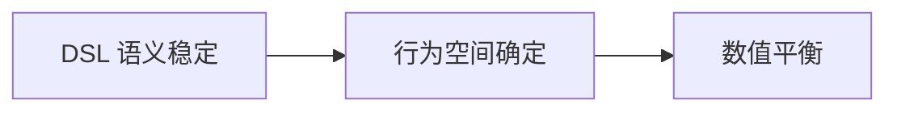
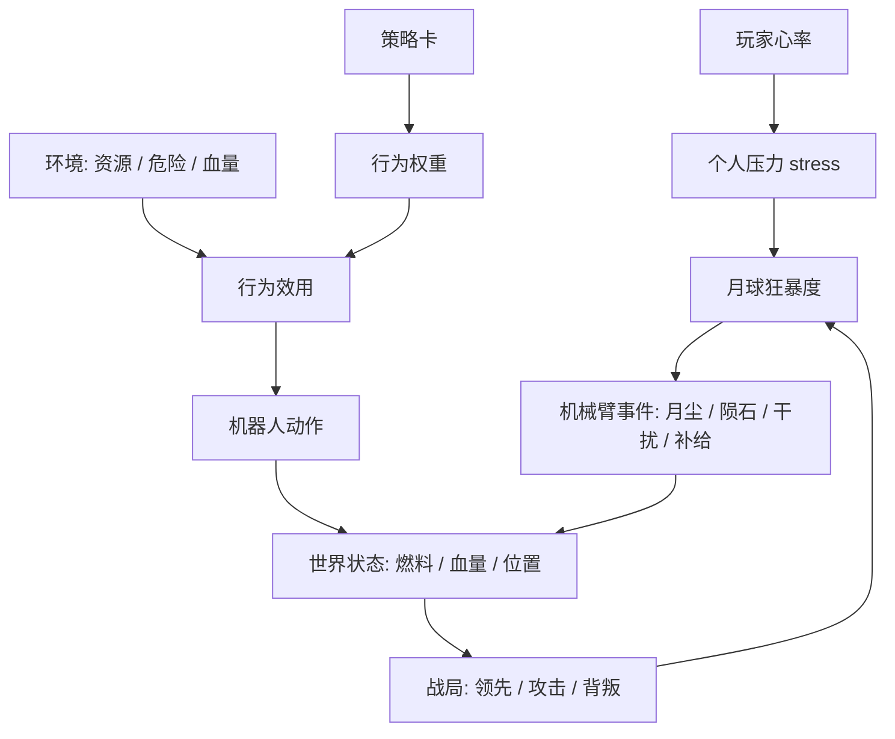

# 数值骨架 v0.1

本文只锁四件事：量纲、关系、阈值、上限。目标是让结构不崩，不是调平衡。具体数值留到 v0.2。

## 设计顺序

数值是 DSL 的参数层。先锁上层，再动下层，顺序不可颠倒。

改动代价从左到右递增。v0.1 只处理最左两层留下的结构约束，不进入最右层的精细调参。

## 1. 量纲

每个量的类型、范围、作用域先定死。数值以后可改，量纲不能变。

| 量 | 类型 | 范围 | 作用域 |
| --- | --- | --- | --- |
| 玩家压力 stress | 连续 | 0–1 | 单玩家，相对个人基线 |
| 月球狂暴度 moon_rage | 连续，分四档 | 0–100 | 全局 |
| 燃料 fuel | 整数 | 0–5 | 阵营 |
| 飞船血量 ship_hp | 整数 | 0–3 | 阵营 |
| 机器人血量 robot_hp | 整数 | 0–3 | 单位，可选血量玩法 |
| 行为权重 weight | 倍率 | 基线 1.0 | 单位内每个行为 |
| 环境系数 env | 倍率 | 围绕 1.0 浮动 | 行为效用输入 |
| 风险惩罚 risk | 绝对分 | 减项 | 行为效用输入 |

行为效用统一为：weight × base_gain × env − risk。前三项是倍率相乘，risk 是减项。卡牌只临时改 weight，不直接改效用。

## 2. 关系

谁影响谁先定清，再谈影响多少。

两条主回路：

1. 生理回路。心率升高抬升狂暴度，狂暴度驱动机械臂降灾，灾难改变战局，战局反过来影响心率。
2. 策略回路。卡牌改行为权重，权重叠加环境算出效用，效用决定机器人动作，动作改变世界状态。

## 3. 阈值

狂暴度四档。低档控制事件频率，高档控制强度与打击目标。

| 档位 | 区间 | 主要变化 | 机械臂行为 |
| --- | --- | --- | --- |
| 沉睡 | 0–24 | 频率最低 | 不行动，或投小燃料 |
| 警觉 | 25–49 | 频率上升 | 投一次月尘或轻障碍 |
| 愤怒 | 50–79 | 强度上升 | 月尘加陨石，压制领先者 |
| 终局 | 80–100 | 强度最高，锁定目标 | 优先干扰点火者，连续降灾 |

其余关键阈值：

| 阈值 | 触发 | 结构含义 |
| --- | --- | --- |
| fuel = 5 | 可宣布点火 | 单人升空门槛 |
| ship_hp = 0 | 飞船坠毁 | 出局条件 |
| 月尘停留 3 秒 | robot_hp − 1，可选血量玩法 | 惩罚滞留，非瞬时 |
| 背叛发生 | moon_rage + 一档增量 | 背叛推高全局风险 |

## 4. 上限

上限决定谁主导节奏，防止单次操作一击定胜负。

| 约束 | 结构规则 |
| --- | --- |
| 每回合机械臂事件 | 至多一次 |
| 每回合行为倾向卡 | 至多一张，除非遗迹卡放开 |
| 主导驱动 | 玩家动作驱动经济即燃料增长，月球事件驱动干扰，两者不可互相取代 |
| 单次事件强度 | 不能让一名玩家从必胜直接变必败，不能封死一名玩家全部路线 |
| RNG 比例 | 事件触发与目标选择走确定性，投放落点带有限随机 |

## 5. 留给 v0.2

以下进入精细调参，在 v0.1 结构稳定后再填：

- 心率每档对应的狂暴度增减值
- 各行为的 base_gain 与 risk 具体分值
- 环境系数的计算式
- 机械臂各事件的冷却与强度曲线
- 遗迹卡与锦囊卡的具体效果数值
