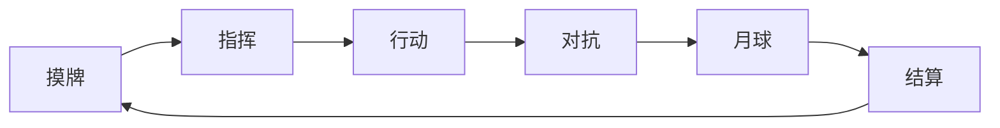

# Game Config 配置手册

本文逐块、逐字段解释 `game_config.schema.json` 定义的一份游戏配置。面向想核对游戏规则的策划与游戏同学：把《逃离月球 MVP 规则》的每一条对到配置里的字段，确认数值和逻辑无误。

配套文件：

- `game_config.schema.json`：机器可校验的 schema，加载时据此拒绝非法配置。
- `examples/moonfall_mvp.game.json`：本手册主示例，逃离月球 MVP 的完整配置。
- `examples/moonfall.game.json`、`examples/scavenger.game.json`：另两种模式，协作 PVE 与纯合作小游戏，验证同一套 schema 能表达不同游戏。

---

## 0. 顶层结构

配置是一份 JSON 或 YAML，由十几个顶层块组成。三个入口手写、可视化编辑器、AI 生成，都产出同一份通过 schema 校验的配置。

| 顶层块 | 职责 | 必填 |
| --- | --- | --- |
| `meta` | 游戏身份：id、标题、模式、人数、时长 | 是 |
| `flow` | 对局节奏：实时或回合制、回合阶段 | |
| `vars` | 可变状态变量，含作用域 | |
| `map` | 地图网格与区域 | 是 |
| `factions` | 阵营 | 是 |
| `relationships` | 阵营关系矩阵，可对局内改写 | |
| `director` | 上帝之手：立场、倾向来源、事件表 | |
| `actuators` | 抽象执行器，按能力引用 | |
| `sensors` | 抽象传感器，按能力引用 | |
| `units` | 自主单位与行为权重 | |
| `inputs` | 卡牌、语音、心率映射 | |
| `rules` | 声明式 when→then | 是 |
| `tuning` | 可现场调的数值 | |

---

## 1. 规则到配置映射表

MVP 规则文档的每条机制，对应配置中的位置。Review 从这张表开始最快。

| MVP 规则 | 配置位置 | 关键值 |
| --- | --- | --- |
| 每人 1 船 1 机器人 | `factions` pa/pb/pc/pd，`units` 每阵营 1 rover | count 1 |
| 飞船 HP 3、燃料槽 0-5 | `vars` fuel、ship_hp | initial/min/max |
| 升空需 5 燃料、HP>0、宣布、机器人回船确认 | `rules.ignition_success`，行为 `ignition_confirm`，卡 `ignition_protocol` | fuel>=5 |
| 排名按升空顺序 | `rules.ignition_success` 的 `lock_rank`，`vars.launched` | — |
| 全员坠毁月球胜 | `rules.game_end_all_resolved`，`end_game` winner moon | — |
| 普通资源+1、中央高能+2、空投+1 | `map.zones` resource，`tuning` yields | 1 / 2 / 1 |
| 资源区初始 5 块、中央 3 块 | `tuning.normal_resource_stock`、`central_stock` | 5 / 3 |
| 遗迹区得遗迹卡，每区 2 张 | `map.zones` relic，行为 `explore_relic`，`inputs.cards.relic_cards`，`tuning.relic_per_zone` | 2 |
| 机器人 6 种自主行为 | `units[].behaviors`，行为库目录见 §5 | 权重 |
| 卡牌影响行为倾向 | `inputs.cards.deck` 的 `boost` | 见 §2.9 |
| 攻击敌船 -1 HP、攻击领先者额外效果 | 卡 `moonrock_strike`、`fuel_raid` 的 `on_hit` | -1 |
| 月尘进入船受伤 | `director.events.dust_storm`，`rules.dust_damage` | -1 |
| 陨石格不可通行 | `director.events.meteor_fall`，zone `meteor_area` | — |
| 发射干扰点火失败、需回船清除 | `director.events.launch_jam`，`vars.jammed`，`rules.ignition_success` | — |
| 狂暴度 0-100 四档 | `vars.moon_rage`，`director.events` 的 when 阈值，`tuning` rage_* | 25/50/80 |
| 心率映射狂暴度，相对基线 | `sensors.hr`，`inputs.biosignal` | 基线 30s |
| 无表保底模式 | `inputs.biosignal.fallback` | — |
| 联盟 1 回合、背叛 +10 狂暴 | `relationships` 动态改写，`rules.betrayal_penalty`，`tuning.betrayal_rage_penalty` | +10 |
| 六个机械臂技能 | `director.events` 四个，`rules` 放置坠毁标记与排名徽章 | — |
| 机械臂放置禁区 | `actuators.arm.safety.no_drop` | 4 类 |
| 回合 6 阶段 | `flow.phases` | 60-90s |
| 排名徽章、坠毁标记 | `rules` 的 `trigger_actuator` | — |

Presenter 为可选能力。MVP 保留 `narrator` 执行器负责背叛播报等解说，产品可不带人形，由大屏虚拟形象或音箱履行同一契约，配置不变。

---

## 2. 逐块字段参考

### 2.1 meta

```yaml
meta:
  id: moonfall_mvp
  title: MoonFall：逃离月球 (MVP)
  schema_version: "1.0"
  mode: ffa                   # coop | pvp | ffa
  players: { min: 4, max: 4 }
  round_sec: [720, 900]       # 单值或 [min, max]
```

| 字段 | 类型 | 说明 |
| --- | --- | --- |
| `id` | 小写蛇形串 | 游戏唯一标识 |
| `title` | 串 | 展示名 |
| `schema_version` | 主.次 | 兼容性版本 |
| `mode` | 枚举 coop/pvp/ffa | 默认阵营布局，真实敌友由 `relationships` 决定 |
| `players.min/max` | 整数 | 人数范围 |
| `round_sec` | 数或 [数,数] | 单局时长，秒 |

### 2.2 flow

```yaml
flow:
  type: turn_based            # realtime | turn_based | hybrid
  turn_sec: [60, 90]
  phases: [draw, command, action, combat, moon, resolve]
```

MVP 的六阶段写在 `phases`，阶段名可被规则引用，如 `when: "phase == combat"`。



### 2.3 vars

核对数值归属的关键块。每个变量声明它是全局一份、每阵营一份、还是每单位一份。

```yaml
vars:
  - { id: fuel,      scope: faction, initial: 0, min: 0, max: 5 }
  - { id: ship_hp,   scope: faction, initial: 3, min: 0, max: 3 }
  - { id: moon_rage, scope: global,  initial: 0, min: 0, max: 100 }
  # 可选血量玩法才声明单位血量，默认 MVP 不含：
  # - { id: robot_hp, scope: unit, initial: 3, min: 0, max: 3 }
```

| 字段 | 说明 |
| --- | --- |
| `scope: global` | 全局一份，引用写 `moon_rage` |
| `scope: faction` | 每阵营一份，引用写 `faction.pa.fuel` 或 `self.fuel` |
| `scope: unit` | 每单位一份，引用写 `unit.<id>.robot_hp` |
| `initial / min / max` | 初值与上下界，引擎钳制在界内 |

MVP 中 fuel 与 ship_hp 都是 `scope: faction`，各船独立。moon_rage 是 `scope: global`，全场共享。这层同时决定了 PVE 与 FFA 的资源归属。机器人血量为可选玩法，默认 MVP 不含。要启用带血量的变体，只需声明 `robot_hp` 变量与相应规则，引擎不改。

### 2.4 map

```yaml
map:
  frame: table_1_2m
  grid: [12, 12]
  zones:
    - { id: ship_a, kind: base, center: [1,1] }
    - { id: resource_left, kind: resource, center: [3,6] }
    - { id: central_hi,    kind: resource, center: [6,6] }
    - { id: relic_top,     kind: relic,  center: [6,2] }
    - { id: dust_area,     kind: hazard, center: [4,8], dynamic: true }
    - { id: meteor_area,   kind: obstacle, center: [3,8], dynamic: true }
    - { id: jam_area,      kind: trap,  center: [8,8], dynamic: true }
```

`kind` 取值：`base` 飞船基地、`resource` 资源区、`relic` 遗迹区、`hazard` 进入受损、`obstacle` 不可通行、`trap` 干扰点、`neutral`、`custom`。`dynamic: true` 表示该区域可被机械臂动态增删。

中央高能与普通资源区都用 `kind: resource`。收益差异不在地图里，而在 `tuning` 的 central_yield 与 normal_resource_yield。核对收益看 tuning。

### 2.5 factions 与 relationships

```yaml
factions:
  - { id: pa, kind: player_team, members: [p1] }
  - { id: pb, kind: player_team, members: [p2] }
  - { id: moon, kind: director }
relationships:
  pa: { pb: enemy, pc: enemy, pd: enemy, moon: enemy }
```

`kind` 取值：`player_team`、`director`、`npc`。缺省关系视为 neutral。

联盟机制是对这张矩阵的临时写操作。口头结盟把双方改为 friendly，持续 1 回合；背叛改回 enemy，并由 `rules.betrayal_penalty` 追加 +10 狂暴。结盟背叛不是特例，是同一张矩阵的写操作。

### 2.6 director

```yaml
director:
  alignment: { pa: neutral, pb: neutral, pc: neutral, pd: neutral }
  tendency_sources: [biosignal, balance, prayer, random]
  events:
    - id: dust_storm
      when: "moon_rage >= 25"
      requires_capability: Manipulator
      cooldown_sec: 60
      do: { actuator: arm, action: drop_dust, target: dust_area, intensity: "moon_rage" }
    - id: central_supply
      when: "moon_rage < 25"
      do: { actuator: arm, action: drop_fuel, target: central_hi }
```

每个 `event` 是一条机械臂技能，`when` 满足就执行 `do`。对应规则文档技能 1 至 4：月尘风暴、陨石坠落、中央燃料空投、发射干扰。技能 5、6 坠毁标记与排名徽章由 `rules` 在对应时机 `trigger_actuator` 放置。

| 字段 | 说明 |
| --- | --- |
| `alignment.<faction>` | 对该阵营 hostile/neutral/benevolent，决定降灾还是补给，可用 `set_alignment` 漂移 |
| `tendency_sources` | 倾向来源：random/biosignal/prayer/balance，balance 为补偿弱势方 |
| `events[].when` | 触发条件表达式，见 §3 |
| `events[].cooldown_sec` | 冷却，防连发 |
| `events[].do` | actuator、action、target、intensity |

### 2.7 actuators 与 sensors

```yaml
actuators:
  - id: arm
    capability: Manipulator
    select: { any: true }
    safety:
      workspace: full_map
      max_force: low
      safe_mode: true
      no_drop: [robot_current_cell, ship_body, player_hands, route_blocking]
  - id: narrator
    capability: Presenter
sensors:
  - { id: hr,  capability: BioSignalSource, per: player }
  - { id: mic, capability: VoiceIntent }
  - { id: loc, capability: PoseSource }
```

`capability` 只能是六类内置 Mover、Manipulator、Presenter、BioSignalSource、VoiceIntent、PoseSource，或注册的扩展能力名。换硬件只换驱动，本块不改。机械臂放置禁区写在 `safety.no_drop`，对应规则文档的禁止投放位置。

配置只声明需要某能力，不声明硬件型号。用真实机械臂还是屏幕虚拟手，由独立的绑定档案决定，见 `examples/binding.software.json` 与 `binding.physical.json`。换一份档案，同一份游戏配置在硬件版与纯软件版之间切换，引擎、规则、行为不变。

### 2.8 units

```yaml
units:
  - type: rover
    faction: pa
    count: 1
    requires: [Mover]
    behaviors:
      collect_fuel: 1.0
      return_and_settle: 1.0
      attack_enemy_ship: 0.6
      return_and_repair: 1.0
      explore_relic: 0.6
      ignition_confirm: 2.0
    tuning: { decide_every_sec: 2 }
```

`behaviors` 的键是行为库中的行为 id，见 §5，值是基线权重。机器人每 1 至 2 秒对所有可用行为打分，选最高执行，效用为卡牌权重乘基础收益乘环境系数减风险惩罚。玩家打卡临时抬高某类权重，这是卡牌影响倾向、机器人自主决策的实现。

### 2.9 inputs

```yaml
inputs:
  cards:
    energy: { max_hand: 3, regen_per_sec: 0 }
    deck: [ 行为倾向卡 ]
    relic_cards: [ 遗迹卡 ]
  voice:
    enabled: true
    action_space: [move_to, collect, attack, return_base, repair, ignition_confirm, stop]
    also_as_prayer: true
  biosignal:
    normalize: per_player_baseline
    calibration: { seconds: 30 }
    mappings:
      - { when: "team_avg_stress_delta > 0", then: [ { adjust: { moon_rage: 10 } } ] }
    fallback: { no_device: { drive_rage_by: turn_and_fuel_and_attacks } }
```

卡牌效果字段 `deck[].effect` 与 `relic_cards[].effect` 是灵活对象。MVP 用到的约定键：

| 键 | 作用 |
| --- | --- |
| `boost: { 行为id: 增量 }` | 行为倾向卡抬高某行为分数 |
| `on_hit: {...}` | 攻击命中后的结算，如 target_ship_hp、target_fuel、self_fuel |
| `on_arrive: grant_relic_card` | 到达后给遗迹卡 |
| `requires: "self.fuel >= 5"` | 使用前置条件 |
| `adjust / immune / steal_hand / allow_multi_behavior_card` | 遗迹卡的一次性效果 |

### 2.10 rules

规则是一张条件到动作表，运行时解释。换游戏换胜负改这里。

```yaml
rules:
  - id: ignition_success
    for_each: faction
    when: "self.fuel >= 5 and self.ship_hp > 0 and self.jammed == 0 and self.declaring_launch == 1 and in_zone(self_rover, self_ship)"
    then:
      - { lock_rank: { faction: self } }
      - { set: { faction.self.launched: 1 } }
      - { trigger_actuator: { actuator: arm, action: place_rank_badge, target: self_ship } }
  - id: dust_lingering
    for_each: rover
    when: "in_zone(self, dust_area) for 3s"
    then: [ { adjust: { unit.self.robot_hp: -1 } } ]
  - id: game_end_all_resolved
    when: "count(faction.*.launched) + count(faction.*.crashed) >= 4"
    then: [ { end_game: { winner: moon } } ]
```

| 字段 | 说明 |
| --- | --- |
| `for_each` | 决定 `self` 指谁：faction、unit、player 或具体单位类型如 rover。省略则规则只判一次，不能用 self。详见 `DSL_EXECUTION_SPEC.md` |
| `when` | 触发条件表达式，见 §3 |
| `once` | 只触发一次 |
| `cooldown_sec` | 冷却 |
| `then` | 动作数组，每个动作对象恰含一个已知动作键 |

`self`、`declaring`、`any_rover` 等词的精确含义由 `DSL_EXECUTION_SPEC.md` 定义。核对规则语义以那份为准，本手册只讲配置字段。

### 2.11 tuning

平衡性数字集中于此，方便现场调参，不改逻辑。

```yaml
tuning:
  fuel_to_launch: 5
  ship_hp_max: 3
  normal_resource_yield: 1
  central_yield: 2
  normal_resource_stock: 5
  central_stock: 3
  relic_per_zone: 2
  rage_wake: 25
  rage_alert: 50
  rage_anger: 80
  betrayal_rage_penalty: 10
  dust_linger_sec: 3
```

---

## 3. when 到 then DSL 参考

`when` 与部分 `intensity` 是表达式字符串。schema 只校验它是字符串，语义由引擎的 DSL 求值器另行校验。

可引用的量：

- `vars` 声明的变量。全局写 `moon_rage`，阵营写 `faction.pa.fuel` 或上下文中的 `self.fuel`，单位写 `unit.<id>.robot_hp`。
- `phase`、`alignment[f]`、`relationship(a,b)`、`tuning.*`。

运算符：`>= <= > < == != and or not`。

函数：`avg() count() max() min() dist(a,b) in_zone(unit, zone) leader(var) calm_streak(f) faction_base(f)`。`faction.*.fuel` 表示对所有阵营取该变量，配合 max 或 count 使用。

修饰符：`once` 触发一次，`cooldown_sec` 冷却，`for <n>s` 持续满足才触发。

动作词表，闭合，每个动作对象恰含一个键：

| 动作 | 作用 |
| --- | --- |
| `set: {路径: 值}` | 赋值状态变量 |
| `adjust: {路径: 增量}` | 增减状态变量，钳制在 min/max |
| `emit_event: {type, message}` | 广播游戏事件 |
| `end_game: {winner}` | 结束对局，判给某阵营 |
| `lock_rank: {faction}` | 为该阵营锁定下一个升空名次 |
| `trigger_event: <event_id>` | 触发一个 director 事件 |
| `trigger_actuator: {actuator, action, target, intensity}` | 直接驱动某执行器 |
| `set_relationship: {a, b, value}` | 改阵营关系 |
| `set_alignment: {faction, value}` | 改上帝对某阵营立场 |
| `spawn / despawn` | 生成或移除单位或道具 |

---

## 4. 能力目录

`capability` 的合法取值。

| 能力 | tier | 语义 | 关键动作 |
| --- | --- | --- | --- |
| `Mover` | core | 自主移动体 | move_to, follow_path, set_led, stop |
| `Manipulator` | core | 对抗性执行器 | pick, place, drop, push, strike, hover_warning, home, emergency_stop |
| `BioSignalSource` | core | 心率与 HRV，每玩家一个 | 上报 hr, rr, stress，相对基线归一 |
| `VoiceIntent` | core | 语音落地到闭合动作空间 | 上报 intent，兼作祈愿 |
| `PoseSource` | core | 全场定位 | 上报各实体世界坐标 |
| `Presenter` | optional | 叙事与解说 | goto, say, gesture, face，产品可由屏幕或音箱履行 |

扩展新硬件：新增一个能力定义与一个声明它的驱动，schema 与引擎不改。

---

## 5. 行为库目录

`units[].behaviors` 的合法键。

| 行为 id | 需要能力 | 语义 |
| --- | --- | --- |
| `collect_fuel` | Mover | 前往资源区采集燃料 |
| `return_and_settle` | Mover | 携燃料返回飞船结算 |
| `attack_enemy_ship` | Mover | 靠近并攻击敌方飞船，目标自主判断 |
| `return_and_repair` | Mover | 血量低返回飞船维修 |
| `explore_relic` | Mover | 前往遗迹区取遗迹卡 |
| `ignition_confirm` | Mover | 集满燃料后返回飞船完成点火确认 |

机器人每 1 至 2 秒对可用行为打分，选最高执行。卡牌通过 `boost` 临时改权重，接入同一套仲裁。

---

## 6. 校验与前端

- 一个校验器。加载配置时，`game_config.schema.json` 拒绝非法结构，如未知模式、缺字段、动作对象含多键、权重写成字符串。
- 三个入口，同一份产物。手写 YAML、可视化编辑器、AI 生成，都产出通过同一校验器的配置，运行时直接执行。
- 本地自检。`pip install -U jsonschema` 后，用 `Draft202012Validator` 校验任一 `examples/*.game.json`。

---

## 7. Review 检查清单

顺着这张清单核对，可快速发现规则与配置不一致。

1. 升空链。`vars.fuel` 上限 5，`rules.ignition_success` 的四个 when 条件，行为 `ignition_confirm`，卡 `ignition_protocol` 是否齐全、数值正确。
2. 收益数值。`tuning` 的 normal_resource_yield 1、central_yield 2、airdrop_yield 1 与规则一致否，初始库存 `*_stock` 呢。
3. 伤害来源。敌方攻击 `on_hit`、月尘 `dust_damage`、干扰 `jammed` 三条路径是否都建模。机器人血量为可选玩法，不在默认清单内。
4. 狂暴度四档。`director.events` 各 when 的 25/50/80 与 `tuning.rage_*` 对齐否，沉睡档投小燃料、终局档优先干扰点火者是否有对应事件。
5. 六个机械臂技能。技能 1 至 4 在 `director.events`，技能 5、6 在 `rules` 的 `trigger_actuator`，逐个核对触发条件与效果。
6. 联盟与背叛。`relationships` 能改成 friendly 否，背叛 +10 狂暴的 `rules.betrayal_penalty` 在否。
7. 心率。`biosignal` 的 30 秒基线、相对归一、无表 `fallback` 三项是否齐。
8. 放置禁区。`actuators.arm.safety.no_drop` 是否覆盖规则文档的四类禁区。

规则的每一条都应能落到配置的某个字段。落不到的，要么规则漏了，要么 schema 需要扩。
