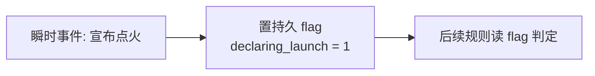
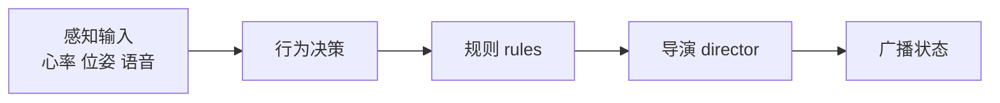

# 规则语言执行规范 v0.1

配置里有很多规则句子，比如「当自己的燃料≥5 就升空」。人知道「自己」指谁，电脑不知道。本文就是电脑执行规则时的词典与说明书。词义一旦定死，后面填数值才不会返工。数值能改，词义不能错。

策划同学看 §0 到 §3 与 §6 即可，工程同学按全文实现求值器。

## 0. 总览

一条规则的形态：

```yaml
- when: "自己燃料≥5 且 船活着 且 喊了点火 且 机器人回到船上"
  then: [ 升空并锁定名次 ]
```

引擎每一刻按这个流程处理一条规则：挑出该检查的规则，判断 `when` 是否为真，为真则执行 `then` 的动作。本文定义三件事：`when` 和 `then` 里的词分别指谁，见 §1 到 §3；动作怎么改状态，见 §4；一刻之内按什么顺序跑，见 §5。

## 1. 三层归属：一个东西属于谁

游戏里每个数值或状态都属于下面三层之一。这是最基础的一层。

| 层 | 谁拥有 | 例子 | 配置里怎么写 |
| --- | --- | --- | --- |
| 全局 world | 整局共一份 | 月球狂暴度 moon_rage | `moon_rage` |
| 阵营 faction | 每阵营各一份 | 燃料 fuel、飞船 HP ship_hp | `faction.pa.fuel` |
| 单位 unit | 每机器人各一份 | 机器人 HP robot_hp | `unit.r1.robot_hp` |

这层决定了 PVE 与 FFA 的资源归属。FFA 里燃料是 faction，每人一份，四人各抢各的。PVE 里核心血量是 global，全队共享。变量声明成 global 就是共享，声明成 faction 就是各自，同一个引擎两种都能跑，保留 PVE 不增加复杂度。

## 2. 上下文：self 与 declaring 是谁

有些词不固定指某个人，要看当下是谁触发规则才知道。一条规则触发时，引擎先绑定下面这些词，再读 `when`。

| 词 | 含义 | 绑定时机 |
| --- | --- | --- |
| `self` | 正在执行这条规则的主体，机器人、船或阵营 | 规则逐个检查对象时，轮到谁就是谁 |
| `declaring` | 喊点火的那个主体，等于事件发起者 event.source | 由宣布点火事件带入 |
| `event` | 触发本规则的事件本身，含来源、类型、数据 | 事件类规则触发时 |
| `world` | 全局状态，地图、狂暴度、当前阶段 phase | 永远可读 |

`self` 随逐个检查而变。很多规则对每一个对象检查一遍。月尘伤害规则对每台机器人各跑一次，跑到 r1 时 `self` 是 r1，跑到 r2 时 `self` 是 r2，`self.fuel` 就是当前这个对象的燃料。

`self` 是机器人、船还是阵营，取决于规则对谁逐个检查。升空规则对阵营检查，`self.fuel` 是这个阵营的燃料。月尘规则对机器人检查，`self` 是机器人。每条规则用 `for_each` 标注检查对象，见 §6。

## 3. 选择器：怎么写某一类东西

有时规则针对符合条件的一批，而非某一个。这类词是选择器。

| 写法 | 含义 | 举例 |
| --- | --- | --- |
| `faction.*` | 所有阵营各取一份，配合 max、count、avg 用 | `max(faction.*.fuel) >= 4` 有没有谁燃料到 4 |
| `any_rover` | 存在任意一台满足条件的机器人 | `in_zone(any_rover, dust_area)` 有没有机器人在月尘里 |
| `of_rover` | 从一台机器人回溯到它所属的阵营或船 | `faction.of_rover.ship_hp` 那台机器人所属船的 HP |
| `in_zone(谁, 哪个区)` | 判断某单位是否在某区域内 | `in_zone(self_rover, self_ship)` 自己机器人回到自己船了吗 |

选择器要么问有没有，用 any 或 count，要么问极值或平均，用 max 或 avg。不允许写含糊的「这台车」却不说是哪台。这样求值器永远知道在算哪一批。

## 4. 两种状态：会记住的与一闪而过的

规则里的东西分两种，不能混。

持久状态会一直保留到被改为止，写进 `vars`。例如 launched 是否升空、jammed 是否被干扰、fuel、ship_hp。改它用 `set` 或 `adjust`。

瞬时事件只在发生的那一刻能被规则接住，不保留。例如玩家宣布点火、机器人命中一次攻击、背叛发生。用 `emit_event` 广播，用 `when: "event.type == ..."` 接。

宣布点火是典型区分。宣布本身是瞬时事件，但「这艘船已宣布、等待判定」是一个状态，要记成持久 flag `declaring_launch = 1`，否则下一刻就忘了它喊过。



## 5. Tick 语义与求值顺序

多条规则可能同时成立，必须规定顺序，否则结果会抖动。

一、固定顺序分组执行。每个 tick 按固定顺序跑几组。



回合制游戏里 `rules` 只在对应 `phase` 跑，例如对抗结算只在 combat 阶段。

二、先读后写。同一 tick 内，所有规则读的是这一刻开始时的世界快照，`then` 的改动先记到暂存区，本组规则全判完再统一写回。规则之间不会读到彼此改了一半的状态，顺序无关，结果稳定。

三、`for Ns` 计时器。像在月尘里停留超过 3 秒这种条件，引擎给每个「规则加对象」配一个计时器，条件为真累加时间，为假清零，累计到 3 秒才算 `when` 成立。计时器由引擎维护，配置不管。

四、`once` 与 `cooldown_sec`。`once` 的规则触发一次后永久关闭。`cooldown_sec` 的触发后进入冷却，冷却期内不再触发。

## 6. MVP 占位符对照表

把 `moonfall_mvp.game.json` 里的占位词，全部对到上面的规范。这张表是词典本体。

| 占位符 | 规范化含义 | 归属 |
| --- | --- | --- |
| `self` | 当前规则 `for_each` 正在检查的对象，船或机器人 | §2 |
| `self.fuel` / `self.ship_hp` | 该阵营自己的燃料或船 HP | §1 |
| `self_rover` / `self_ship` | 该阵营的机器人或船 | §3 |
| `declaring` | 喊点火的阵营，等于 event.source，用于 lock_rank | §2 |
| `self.declared_launch` | 改为持久 flag `self.declaring_launch` | §4 |
| `any_rover` | 存在满足条件的任意机器人 | §3 |
| `of_rover` | 从机器人回溯其阵营或船，`faction.of_rover.ship_hp` | §3 |
| `team_avg_stress_delta` | `avg(faction.self.members.stress)`，本队各人相对基线变化取平均 | §1 加 §3 |
| `faction.*.declaring_launch` / `faction.*.crashed` | 各阵营的持久 flag，配合 count 判结束 | §1 加 §4 |

规范化后，两条规则的写法：

```yaml
# 月尘持续伤害，对每台机器人检查
- id: dust_lingering
  for_each: rover
  when: "in_zone(self, dust_area) for 3s"
  then: [ { adjust: { unit.self.robot_hp: -1 } } ]

# 升空成功，对每个阵营检查
- id: ignition_success
  for_each: faction
  when: "self.fuel >= 5 and self.ship_hp > 0 and self.jammed == 0
         and self.declaring_launch == 1 and in_zone(self_rover, self_ship)"
  then:
    - { lock_rank: { faction: self } }
    - { set: { faction.self.launched: 1 } }
```

改动要点：每条规则加 `for_each` 说清 self 是谁；`declared_launch` 从瞬时改成持久 flag `declaring_launch`；`declaring` 统一成 self，因为已按 `for_each: faction` 逐个检查。

## 7. 一条规则从头到尾走一遍

以升空成功为例，看引擎在某个 resolve 阶段的 tick 里做了什么。

1. 玩家 p1 在 command 阶段喊点火，引擎广播事件 `{type: declare_launch, source: pa}`，一条小规则把 `faction.pa.declaring_launch` 置 1。
2. 到 resolve 阶段，引擎对 `ignition_success` 按 `for_each: faction` 检查，轮到 pa 时 self 是 pa。
3. 读这一刻的快照判断 `when`：pa 燃料 5、船 HP>0、没被干扰、declaring_launch 为 1、机器人在自己船上，全真。
4. 把 `then` 的改动记到暂存区：给 pa 锁一个名次、pa.launched 置 1、机械臂放排名徽章。
5. 本组规则全判完，统一写回状态，大屏更新排名，机械臂执行放徽章。
6. 下一 tick，`game_end_all_resolved` 数 `count(faction.*.launched) + count(faction.*.crashed)`，到 4 结束。

## 8. v0.1 定了什么

定了：三层归属、上下文 self/declaring/event/world、选择器 any/of/in_zone/faction.*、状态与事件的区分、tick 顺序与读写分相、`for Ns` 计时。这些是语义，改动代价最大，先锁。

暂不定：表达式的语法细节如括号与函数全集，实现时可复用一个受限的安全表达式求值器，不必造完整语言；以及所有数值如心率每档增减、卡牌能量、行为基础收益，等语义稳定后再填。

下一步：数值骨架见 `BALANCE_SKELETON_v0.1.md`，稳定后再进入精细调参。
