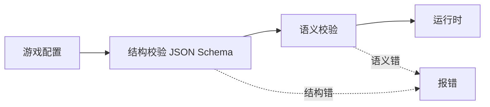

# 第二层语义校验规范 v0.1

一份配置要过两道校验才可执行。第一道是 JSON Schema，只看结构：字段类型、枚举值、必填项、动作对象是否恰含一个键。它有一个盲区，只要结构对就放行，哪怕内容是坏的。

下面这条规则结构完全合法，能过 schema：

```yaml
- id: win
  when: "faction.pz.fuel >= 5"     # pz 这个阵营从未声明
  then: [ { end_game: { winner: pz } } ]
```

schema 不知道 pz 是否存在、fuel 是否是阵营变量、pz 能否作为 winner。这类引用错误会一路带到运行时才暴露，或更糟，静默跑出错误行为。配置数量增多、越来越多由 AI 生成后，这类错误只会更常见。第二道校验就是补这个盲区：在结构合法之后、进入运行时之前，检查配置内部的引用是否自洽、表达式是否有意义。

## 1. 定位

JSON Schema 管结构，语义校验管引用与语义，在结构合法之后、进入运行时之前运行。



两道关都通过，配置才可执行。三个前端手写、可视化编辑器、AI 生成产出的配置都过同一套校验。

## 2. 检查项

### 2.1 引用完整性

配置内部引用的 id 必须已声明。

| 引用处 | 必须存在于 |
| --- | --- |
| `units[].faction` | `factions[].id` |
| `relationships` 的键与子键 | `factions[].id` |
| `director.alignment` 的键 | `factions[].id` |
| `director.events[].do.actuator` | `actuators[].id` |
| `director.events[].do.target` | `map.zones[].id` 或单位 |
| `rules`/`director.events` 引用的行为 | 行为库目录 |
| `units[].behaviors` 的键 | 行为库目录 |
| 动作 `trigger_actuator.actuator` | `actuators[].id` |
| 动作 `trigger_event` | `director.events[].id` |
| 动作 `lock_rank/end_game/set_relationship/set_alignment` 的 faction | `factions[].id` |

### 2.2 能力匹配

| 检查 | 规则 |
| --- | --- |
| `do.action` 与执行器能力 | 该 actuator 的 capability 必须声明了这个 action |
| `director.events[].requires_capability` | 必须有一个 actuator 或 sensor 提供该能力 |
| `units[].requires` | 声明单位所需能力，其是否有驱动提供，在应用绑定档案时检查，见 §4 |

### 2.3 变量与作用域

| 检查 | 规则 |
| --- | --- |
| 表达式引用的变量 | 必须在 `vars` 声明，或为内置量 phase、alignment、tuning |
| 作用域写法 | `faction.<id>.<v>` 的 v 必须 `scope: faction`，`unit.<id>.<v>` 必须 `scope: unit`，裸名必须 `scope: global` |
| `self` 的使用 | 所在规则必须有 `for_each`，否则 self 无绑定 |
| 选择器上下文 | `self_rover`、`of_self` 等要求 `for_each` 提供当前对象 |
| 写入界限 | `set`/`adjust` 的目标变量必须存在且可写 |

### 2.4 DSL 表达式

| 检查 | 规则 |
| --- | --- |
| 语法 | `when`、`intensity` 字符串可被求值器解析 |
| 函数名 | 只能是允许集 avg/count/max/min/dist/in_zone/leader/calm_streak/faction_base |
| 函数参数 | `in_zone` 的区域参数必须是已声明 zone，`faction_base` 的参数必须是 faction |
| 修饰符 | `for <n>s` 的 n 为正数 |

### 2.5 动作合法性

| 检查 | 规则 |
| --- | --- |
| 单键约束 | 每个动作对象恰含一个已知动作键，由 schema 保证，此处复核 |
| `end_game.winner` | faction 存在 |
| `set_relationship.value` | friendly/enemy/neutral 之一 |
| `set_alignment.value` | hostile/neutral/benevolent 之一 |

## 3. 报错要求

每条错误给出：位置为配置内的路径，如 `rules[2].then[0].lock_rank.faction`；期望值；实际值。

错误结构化输出，供三个前端统一消费。AI 生成器把这些错误喂回模型，触发自愈重写。

## 4. 两种校验上下文

语义校验分两种，一种只看配置本身，一种要等选定运行环境。

第一种是 §2 的全部检查，只看游戏配置内部，与用什么硬件无关。比如「规则引用的阵营是否声明过」，换任何设备结论都一样。

第二种是能力可用性检查，需要配合绑定档案。绑定档案是一份单独的文件，规定每个能力由哪个驱动实现，比如把机械臂能力接到真实机械臂，或接到屏幕上的模拟机械臂，见 `examples/binding.software.json` 与 `binding.physical.json`。游戏配置只声明需要哪些能力，接到什么设备由绑定档案决定。

这一步用于确认：配置里用到的每个能力，所选的绑定档案都提供了对应的驱动。以机械臂为例，一份需要机械臂的配置，如果用硬件档案来跑、而现场没有接上机械臂驱动，这一步就会报缺失；如果换成纯软件档案，机械臂由屏幕模拟提供，检查就能通过。可见能力齐不齐取决于选了哪份档案，而不取决于游戏配置本身，所以要等选定档案之后才能查。
